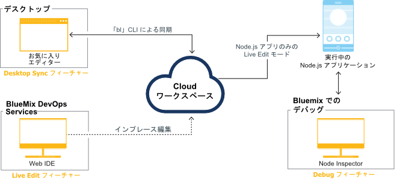

{:shortdesc: .shortdesc}
{:screen: .screen}
{:new_window: target="_blank"}

#{{site.data.keyword.Bluemix_notm}} Live Sync {: #live-sync}

*最終更新日: 2015 年 12 月 8 日*  

Node.js アプリケーションを作成する場合、{{site.data.keyword.Bluemix}} Live Sync を使用すると、{{site.data.keyword.Bluemix_notm}} にあるアプリケーション・インスタンスを迅速に更新して、デスクトップにある場合と同じように再デプロイせずに開発することができます。   
{: shortdesc} 

変更を行うと、実行中の {{site.data.keyword.Bluemix_notm}} アプリケーションでその変更を即時に確認できます。
{{site.data.keyword.Bluemix_notm}} Live Sync は、コマンド・ラインと Web IDE 内のどちらからでも機能します。Node.js で書かれたアプリケーションを {{site.data.keyword.Bluemix_notm}} Live Sync を使用してデバッグできます。  

{{site.data.keyword.Bluemix_notm}} Live Sync は、3 つのフィーチャーで構成されています。 

**Desktop Sync**  
    Dropbox の動作と同じように、デスクトップの任意のディレクトリー・ツリーをクラウド・ベースのプロジェクト・ワークスペースと同期させることができます。Web IDE は、同じクラウド・ベース・ワークスペースを直接編集するので、両者は常に同期が取れた状態にあります。Desktop Sync は、どのような種類のアプリケーションに対しても機能します。Desktop Sync を使用するには、BL コマンド・ライン・インターフェースをダウンロードしてインストールする必要があります。  
	
**Live Edit**	
    {{site.data.keyword.Bluemix_notm}} で実行中の Node.js アプリケーションに変更を加え、その変更をブラウザーで直ちにテストすることができます。同期されているデスクトップ・ディレクトリー内または Web IDE 内で加えた変更はすべて、直ちに当該アプリケーションのファイル・システムに伝搬されます。  
	
**Debug**  
    Node.js アプリケーションが Live Edit モードになっている間は、そのアプリケーションにシェルを作成してデバッグできます。Node Inspector というデバッガーを使用して、コードの動的な編集、ブレークポイントの挿入、コードのステップスルー、ランタイムの再始動などを行うことができます。  

Desktop Sync を使用すれば、デスクトップのワークスペースを、Web IDE を使用して直接編集するクラウド・ベースのプロジェクト・ワークスペースと同期が取れた状態で維持することができます。Live Edit を使用すれば、クラウド・ベースのプロジェクト・ワークスペース内の変更内容を、実行中のアプリケーションに伝搬させることができます。この 2 つのフィーチャーは、いずれか 1 つを使用することも、両方使用することもできます。そして、Desktop Sync または Live Edit を使用してアプリケーションを Live Edit モードにすると、実行中のアプリケーションをデバッグできます。

Bluemix Live Sync プロセスを以下の図に示します。	

*図 1. Bluemix Live Sync プロセス*

 
Liberty で実行される Java アプリケーションを開発している場合、[Eclipse Tools for Bluemix](../manageapps/eclipsetools/eclipsetools.html#eclipsetools) を使用してリモートでデバッグすることができます。

##Desktop Sync {: #desktop-sync} 

Bluemix Live Sync の Desktop Sync フィーチャーを使用すれば、{{site.data.keyword.Bluemix_notm}} にあるアプリケーション・インスタンスを素早く更新し、デスクトップにある場合と同じように開発することができます。 

Desktop Sync では以下の点を考慮してください。 
* Desktop Sync は、以下のオペレーティング・システムで稼働します。 
  * Windows 7 または 8
  * Mac OS X バージョン 10.9 以降
      **注:** Windows には .NET Framework バージョン 4.5 が必要です。.NET がインストールされていない場合、{{site.data.keyword.Bluemix_notm}} Live Sync コマンド・ライン・インターフェース (CLI) のインストール時に、それもインストールするようにプロンプトが出されます。  
* Git リポジトリーの複製は不要です。 
* 開発するアプリケーションのタイプに関わらず、デスクトップのプロジェクトをクラウド・ワークスペースと同期させることができます。 
* アプリケーションが Node.js で書かれている場合、変更内容を実行中のアプリケーションに伝搬できます。

コマンドについて詳しくは、[Bluemix Live Sync CLI 資料](../cli/reference/bl/index.html)を参照してください。 

<ol>
<li>{{site.data.keyword.Bluemix_notm}} Live Sync bl コマンド・ラインをダウンロードし、インストールします。   
<p>
<a class="xref" href="http://livesyncdownload.ng.bluemix.net/downloads/blive_setup.msi" target="_blank" title="(新しいタブまたはウィンドウで開きます)"> </a>
<a class="xref" href="http://livesyncdownload.ng.bluemix.net/downloads/BluemixLive.pkg" target="_blank" title="(新しいタブまたはウィンドウで開きます)"> </a>
</p>  

<strong>重要:</strong> bl コマンド・ライン・ツールは、Windows 7 と 8、および Mac OS X バージョン 10.9 以降でのみ使用可能です。</li>
<li>コマンド・ラインで、以下のコマンドを使用してログインします。IBM ID とパスワードを求めるプロンプトが出されます。  
<pre class="codeblock">bl login</pre>
</li>

<li>以下のコマンドを入力して、{{site.data.keyword.Bluemix_notm}} Live Sync で同期できるプロジェクトのリストを表示します。
<pre class="codeblock">bl projects</pre>
<p>ご使用のアプリケーションに一致するプロジェクト名をリスト内で見つけます。プロジェクト名のフォーマットは、<i>your alias</i> | <i>your application name</i> です。</p>
</li>
<li>以下のコマンドを入力し、ローカル環境を {{site.data.keyword.Bluemix_notm}} 上のプロジェクトと同期させます。プロジェクトの所有者なら、projectName に your-application-name を指定すれば済みます。<pre class="codeblock">bl sync projectName -d localDirectory --verbose</pre>
<p>このコマンドは、「q」を入力するまで継続して実行されます (そして同期化が続行されます)。--verbose オプションにより、ロギング情報と状況情報が表示されます。引数に空白を含むものがある場合は、名前を引用符で囲む必要があります。</p></li>
<li>別のコマンド・ライン・ウィンドウのローカル・ディレクトリーで以下のコマンドを入力し、アプリケーションを Live Edit モードで {{site.data.keyword.Bluemix_notm}} にデプロイします。
<pre class="codeblock">bl start</pre>
</li>
</ol>

ローカル・ディレクトリーにあるファイルを変更すると、その変更内容は、{{site.data.keyword.Bluemix_notm}} で稼動しているアプリケーションとプロジェクト・クラウド・ワークスペースの両方に自動的に伝搬します。
Node アプリケーションの再始動が必要な場合は、以下のコマンドを使用できます。
```
bl start --restart 
```

##Live Edit {: #live-edit} 

Node.js アプリケーションをビルドしている場合、Web IDE を使用してプロジェクトに変更を加えると、{{site.data.keyword.Bluemix_notm}} Live Sync の Live Edit フィーチャーによって、{{site.data.keyword.Bluemix_notm}} で実行中のアプリケーションを素早く更新できます。Live Edit を使用すれば、デスクトップにある場合と同じように再デプロイせずに開発することができます。 

Live Edit がサポートされるのは Node.js アプリケーションのみです。 

Web IDE の実行バーで、**「Live Edit」**をクリックします。 

 

Live Edit を使用すれば、{{site.data.keyword.Bluemix_notm}} で実行中の Node.js アプリケーションに対する変更を迅速にプレビューできます。Live Edit をオンにしてコードを更新すると、変更を加えてからほんの数秒で、Web アプリケーションのブラウザー・ウィンドウを最新表示して変更が反映されたことを確認できます。 

{{site.data.keyword.Bluemix_notm}} Live Sync の Live Edit フィーチャーの使用に関するチュートリアルについては、「[Bluemix Live Sync を使用した Node.js アプリのテストおよびデバッグ](https://hub.jazz.net/tutorials/livesync)」チュートリアルを参照してください。

Web IDE 内でファイルを変更すると、それらのファイルは {{site.data.keyword.Bluemix_notm}} で実行中のアプリケーションに自動的に再デプロイされます。Node アプリケーションの再始動が必要な場合、実行バーにある **「再始動」**ボタンを使用できます。

##{{site.data.keyword.Bluemix_notm}} Live Debug {: #live-debug}

{{site.data.keyword.Bluemix_notm}} Live Sync が Node.js アプリに対して使用可能になっている場合、{{site.data.keyword.Bluemix_notm}} Live Sync Debug フィーチャーにアクセスできます。 

Debug を使用すると、アプリが {{site.data.keyword.Bluemix_notm}} で実行されている間に、コードの動的な編集、ブレークポイントの挿入、コードのステップスルー、ランタイムの再始動などを行うことができます。{{site.data.keyword.Bluemix_notm}} の多数のサービスのリストから選択しながら、アプリを段階的に素早く開発できます。 

{{site.data.keyword.Bluemix_notm}} Live Debug には、以下のフィーチャーが含まれています。

* アプリケーション・ランタイム制御
* [node-inspector](https://github.com/node-inspector/node-inspector) を使用したデバッグ
* シェル・アクセス 

###アプリケーション・ランタイム制御{: #app-runtime} 

アプリケーション・ランタイム制御により、Debug を使用してアプリの開始時の状態を検査することができます。この機能は、始動時に異常終了するアプリをトラブルシューティングする際に役立ちます。

アプリの開発中、次のアクションから選択できます。

* アプリの素早い再始動を実行する。
* アプリのコードが実行される前にアプリを一時停止する。

###Debug {: #debug} 

Debug には、以下の機能が含まれています。

**制限:** Google Chrome が必要です。

* アプリ・コードにブレークポイントを設定して、特定の行で実行を一時停止する。
* ブレークポイントの条件を編集して、特定の条件が満たされた場合にのみ実行を一時停止する。 
* ローカル変数やフィールドの状態を検査する。 
* `console.log()` 呼び出しからのデバッグ出力を即座に表示する。cf ログをモニターするより、このアクションの方がより迅速です。
* 組み込みソース・コード・エディターを使用して、実行中のアプリ・コードに即時 (ただし一時的な) 変更を行う。

###シェル {: #shell} 

このツールは、アプリが実行されているコンテナーへのシェル・アクセスを提供します。この端末を使用することにより、診断シェル・コマンドをリモート側で実行してアプリを管理することができます。 

標準的な Linux コマンド (**top**、**ps**、および **kill** など) を使用するインスタンス内でメモリーおよび CPU の使用量をモニターします。 

###{{site.data.keyword.Bluemix_notm}} Live Debug を使用可能にするためのアプリの構成{: #configure_app_debug} 

アプリは、IBM SDK for Node.js ビルドパックを使用する必要があります。カスタム・ビルドパックはサポートされていません。 

1. ビルドパックがアプリの start コマンドを検出できるようにします。start コマンドは、`manifest.yml` ファイル内に設定されるのではなく、ビルドパックによって自動検出される必要があります。  
    
    a. `package.json` ファイルに、アプリの start コマンドを含む開始スクリプトを含めるようにします。  
    b. アプリの `manifest.yml` ファイルにコマンドが含まれている場合は、それをヌルに設定します。  

2. 環境変数を設定します。  
    
    a. `manifest.yml` ファイルに次の変数を追加します。
	```
	env:
      ENABLE_BLUEMIX_DEV_MODE: "true" 
	```

3. メモリーを増やします。  
    
    a. アプリの `manifest.yml` ファイルで、メモリー属性に指定されている値に 128M 以上を追加します。 
	
{{site.data.keyword.Bluemix_notm}} Live Debug がインストールされたら、デバッグ・ツールを使用することができます。

アプリをプッシュし、`https://app-host.mybluemix.net/bluemix-debug/manage` を参照して {{site.data.keyword.Bluemix_notm}} デバッグ・ユーザー・インターフェースにアクセスします。プロンプトが出されたら、認証のために IBM ID とパスワードを入力してください。 

###アプリ構成の復元および Bluemix Live Debug の使用不可化{: #restore_live_debug} 

1. アプリの `manifest.yml` ファイルから ENABLE_BLUEMIX_DEV_MODE 環境変数を削除します。

2. アプリの、元の start コマンドとメモリー値を復元します。 

3. アプリをプッシュします。


># 関連リンク{:class="linklist"}
>## チュートリアルおよびサンプル{:id="samples"}
>* [Test and debug a Node.js app with Bluemix Live Sync](https://hub.jazz.net/tutorials/livesync)
>
># 関連リンク{:class="linklist"}
>## 関連リンク{:id="general"}
>* [bl コマンド](https://www.ng.bluemix.net/docs/cli/bl_cli.html)   
>
>{:elementKind="article" id="rellinks"}
