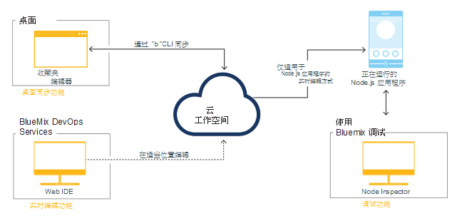

{:shortdesc: .shortdesc}
{:screen: .screen}
{:new_window: target="_blank"}

#{{site.data.keyword.Bluemix_notm}} Live Sync{: #live-sync}

*上次更新时间：2015 年 12 月 8 日*  

如果您要构建 Node.js 应用程序，那么可以使用 {{site.data.keyword.Bluemix}} Live Sync 快速更新 {{site.data.keyword.Bluemix_notm}} 上的应用程序实例，并像在桌面上进行操作一样进行开发，而无需重新部署。   
{: shortdesc} 

执行更改后，您可以立即在运行中的 {{site.data.keyword.Bluemix_notm}} 应用程序中看到该更改。{{site.data.keyword.Bluemix_notm}} Live Sync 可从命令行以及在 Web IDE 中运行。您可以使用 {{site.data.keyword.Bluemix_notm}} Live Sync 来调试以 Node.js 编写的应用程序。  

{{site.data.keyword.Bluemix_notm}} Live Sync 由三个功能部件组成。 

**桌面同步**  
    您可以将任何桌面目录树与基于云的项目工作空间同步，具体与 Dropbox 的工作方式类似。Web IDE 会直接编辑同一基于云的工作空间，因此两者会保持同步。“桌面同步”适用于任何类型的应用程序。要使用“桌面同步”，需要下载和安装 BL 命令行界面。  
	
**实时编辑**	
    您可以对 {{site.data.keyword.Bluemix_notm}} 中运行的 Node.js 应用程序进行更改，然后立即在浏览器中测试这些更改。在同步的桌面目录中或在 Web IDE 中进行的任何更改都会立即传播到应用程序的文件系统中。  
	
**调试**  
    当 Node.js 应用程序处于“实时编辑”方式时，您可以创建 shell 并在其中进行调试。您可以使用 Node Inspector 调试器来动态编辑代码、插入断点、单步执行代码、重新启动运行时，等等。  

您可以使用“桌面同步”来保持桌面工作空间与您使用 Web IDE 直接编辑的基于云的项目工作空间同步。您可以使用“实时编辑”将基于云的项目工作空间中的更改传播到运行中应用程序。这两个功能部件，既可以使用其中一个，也可以两个同时使用。而且，如果使用“桌面同步”或“实时编辑”将应用程序置于“实时编辑”方式，那么可以调试运行中应用程序。

下图说明了 Bluemix Live Sync 过程。	

*图 1. Bluemix Live Sync 过程*

 
如果您要开发在 Liberty 上运行的 Java 应用程序，那么可以使用 [Eclipse Tools for Bluemix](../manageapps/eclipsetools/eclipsetools.html#eclipsetools) 进行远程调试。

##桌面同步{: #desktop-sync} 

您可以使用 Bluemix Live Sync 的“桌面同步”功能来快速更新 {{site.data.keyword.Bluemix_notm}} 上的应用程序实例，并像在桌面上进行操作一样进行开发。 

“桌面同步”的注意事项如下： 
* “桌面同步”在以下这些操作系统上运行： 
  * Windows 7 或 8
  * Mac OS X V10.9 或更高版本
      **注：**Windows 需要 .NET Framework V4.5。如果您未安装 .NET，那么在您安装 {{site.data.keyword.Bluemix_notm}} Live Sync 命令行界面 (CLI) 时会提示您安装 .NET。  
* 无需克隆 Git 存储库。 
* 无论开发的应用程序是哪种类型，都可以将桌面项目与云工作空间进行同步。 
* 如果应用程序是用 Node.js 编写的，那么可以将更改传播到运行中应用程序。

有关命令的更多详细信息，请参阅 [Bluemix Live Sync CLI 文档](../cli/reference/bl/index.html)。 

<ol>
<li>下载并安装 {{site.data.keyword.Bluemix_notm}} Live Sync bl 命令行。   
<p>
<a class="xref" href="http://livesyncdownload.ng.bluemix.net/downloads/blive_setup.msi" target="_blank" title="（在新选项卡或窗口中打开）"></a>
<a class="xref" href="http://livesyncdownload.ng.bluemix.net/downloads/BluemixLive.pkg" target="_blank" title="（在新选项卡或窗口中打开）"></a>
</p>  

<strong>重要信息：</strong>bl 命令行工具仅适用于 Windows 7 和 8 以及 Mac OS X V10.9 或更高版本。</li>
<li>在命令行上，使用以下命令登录。系统将提示您输入 IBM 标识和密码。  
<pre class="codeblock">bl login</pre>
</li>

<li>通过输入以下命令，查看可用于 {{site.data.keyword.Bluemix_notm}} Live Sync 同步的项目的列表：<pre class="codeblock">bl projects</pre>
<p>在列表中找到匹配您应用程序的项目名称。项目名称的格式为 <i>alias</i> | <i>your application name</i>。</p>
</li>
<li>通过输入以下命令，将本地环境与 {{site.data.keyword.Bluemix_notm}} 上的项目同步。如果您是项目所有者，那么只需为 projectName 指定 your-application-name 即可。<pre class="codeblock">bl sync projectName -d localDirectory --verbose</pre>
<p>此命令继续运行（同步也将继续），直到您输入“q”。--verbose 选项用于显示日志记录和状态信息。如果任何自变量中包含空格，那么需要为该名称加引号。</p></li>
<li>在另一个命令行窗口中，在本地目录下，通过输入以下命令，以“实时编辑”方式将应用程序部署到 {{site.data.keyword.Bluemix_notm}}。<pre class="codeblock">bl start</pre>
</li>
</ol>

更改本地目录中的文件时，系统会自动将更改传播到正在 {{site.data.keyword.Bluemix_notm}} 上运行的应用程序以及项目云工作空间中。如果需要重新启动 Node 应用程序，那么可以使用以下命令：```
bl start --restart
```

##实时编辑{: #live-edit} 

如果您要构建 Node.js 应用程序，那么在使用 Web IDE 对项目进行更改后，可以使用 {{site.data.keyword.Bluemix_notm}} Live Sync 的“实时编辑”功能来快速更新 {{site.data.keyword.Bluemix_notm}} 上运行的应用程序实例。利用“实时编辑”，无需重新部署即可像在桌面上一样进行开发。 

“实时编辑”仅支持用于 Node.js 应用程序。 

在 Web IDE 中，单击运行栏中的**实时编辑**。 

 

使用“实时编辑”，可以快速预览对 {{site.data.keyword.Bluemix_notm}} 上运行的 Node.js 应用程序所进行的更改。如果在打开“实时编辑”的情况下更新代码，那么在执行更改之后仅需几秒钟的时间，就可以通过刷新 Web 应用程序浏览器窗口看到这些更改反映出来。 

有关使用 {{site.data.keyword.Bluemix_notm}} Live Sync 的“实时编辑”功能的教程，请参阅教程 [Test and debug a Node.js app with Bluemix Live Sync](https://hub.jazz.net/tutorials/livesync)。

当您在 Web IDE 中更改文件时，系统会自动将它们重新部署到 {{site.data.keyword.Bluemix_notm}} 上运行的应用程序中。如果需要重新启动 Node 应用程序，那么可以使用运行栏中的**重新启动**按钮。

##{{site.data.keyword.Bluemix_notm}} 实时调试{: #live-debug}

只要为您的 Node.js 应用程序启用了 {{site.data.keyword.Bluemix_notm}} Live Sync，就可以访问 {{site.data.keyword.Bluemix_notm}} Live Sync 的“调试”功能。 

使用“调试”，可以执行动态编辑代码、插入断点、单步调试代码、重新启动运行时等操作，而且所有这些操作都可在 {{site.data.keyword.Bluemix_notm}} 为应用程序提供服务期间来执行。通过从大型 {{site.data.keyword.Bluemix_notm}} 服务列表中进行选择，可以快速地逐步开发应用程序。 

{{site.data.keyword.Bluemix_notm}} 实时调试包括以下功能：

* 应用程序运行时控件
* 使用 [node-inspector](https://github.com/node-inspector/node-inspector) 进行调试
* shell 访问 

###应用程序运行时控件{: #app-runtime} 

利用应用程序运行时控件，您可以使用“调试”在启动时检测应用程序的状态。当您对启动时崩溃的应用程序进行故障诊断时，此功能很有用。

在开发应用程序时，可以从以下操作进行选择：

* 快速重新启动应用程序
* 运行任何应用程序代码之前暂挂应用程序

###调试{: #debug} 

“调试”包括以下功能：

**限制：**Google Chrome 是必需的。

* 在应用程序代码中设置断点，以在特定行暂停执行。
* 编辑断点条件以仅在满足特定条件时暂停执行。 
* 检查本地变量和字段的状态。 
* 立即查看 `console.log()` 调用的调试输出。此操作比监视 cf 日志速度更快。
* 使用内置源代码编辑器对运行中应用程序代码立即执行临时更改。

###shell{: #shell} 

使用此工具，可以通过 shell 访问您的应用程序运行所在的容器。通过使用此终端，您可以远程运行诊断 shell 命令以管理您的应用程序。 

使用标准 Linux 命令（例如，**top**、**ps** 和 **kill**），监视实例中的内存和 CPU 使用量。 

###将应用程序配置为启用 {{site.data.keyword.Bluemix_notm}} 实时调试{: #configure_app_debug} 

应用程序必须使用 IBM SDK for Node.js buildpack。不支持定制 buildpack。 

1. 允许 buildpack 检测应用程序 start 命令。start 命令必须由 buildpack 自动检测，而不是在 `manifest.yml` 文件中设置。  
    
    a. 确保 `package.json` 文件包含启动脚本，其中含有应用程序的 start 命令。  
    b. 如果应用程序 `manifest.yml` 文件包含命令，请将其设置为 null。  

2. 设置环境变量。  
    
    a. 在 `manifest.yml` 文件中，添加以下变量：
	```
	env:
      ENABLE_BLUEMIX_DEV_MODE: "true" 
	```

3. 增大内存。  
    
    a. 在应用程序 `manifest.yml` 文件中，将指定给内存属性的值加上 128M 或更大的值。 
	
在安装 {{site.data.keyword.Bluemix_notm}} 实时调试后，可以使用调试工具。

推送应用程序，然后浏览到 `https://app-host.mybluemix.net/bluemix-debug/manage`，以访问 {{site.data.keyword.Bluemix_notm}} 调试用户界面。出现提示时，请输入您的 IBM 标识和密码进行认证。 

###复原应用程序配置并禁用 Bluemix 实时调试{: #restore_live_debug} 

1. 从应用程序 `manifest.yml` 文件中除去 ENABLE_BLUEMIX_DEV_MODE 环境变量。

2. 复原应用程序的原始 start 命令和内存值。 

3. 推送应用程序。


># 相关链接{:class="linklist"}
>## 教程和样本{:id="samples"}
>* [Test and debug a Node.js app with Bluemix Live Sync](https://hub.jazz.net/tutorials/livesync)
>
># 相关链接{:class="linklist"}
>## 相关链接{:id="general"}
>* [bl 命令](https://www.ng.bluemix.net/docs/cli/bl_cli.html)   
>
>{:elementKind="article" id="rellinks"}
