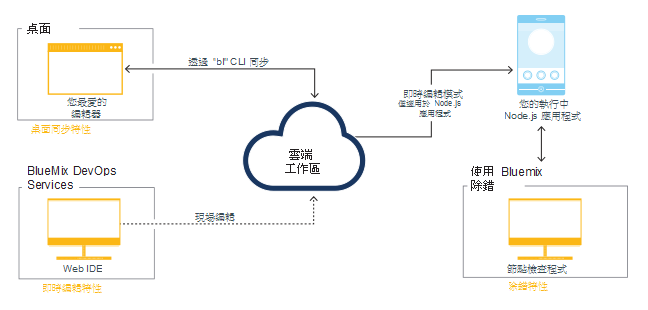

{:shortdesc: .shortdesc}
{:screen: .screen}
{:new_window: target="_blank"}

#{{site.data.keyword.Bluemix_notm}} Live Sync {: #live-sync}

*前次更新：2015 年 12 月 8 日*  

如果您要建置 Node.js 應用程式，可以使用 {{site.data.keyword.Bluemix}} Live Sync 快速更新 {{site.data.keyword.Bluemix_notm}} 上的應用程式實例，並像在桌面上那樣地開發應用程式而不必重新部署。   
{: shortdesc} 

當您進行變更時，可以立即在執行中的 {{site.data.keyword.Bluemix_notm}} 應用程式看到該變更。{{site.data.keyword.Bluemix_notm}} Live Sync 在指令行及 Web IDE 中均可運作。您可以使用 {{site.data.keyword.Bluemix_notm}} Live Sync，針對以 Node.js 撰寫的應用程式進行除錯。  

{{site.data.keyword.Bluemix_notm}} Live Sync 包含三個特性。 

**桌面同步**  
    您可以使用雲端型專案工作區來同步化任何桌面目錄樹，運作方式類似 Dropbox。Web IDE 會直接編輯相同的雲端型工作區，讓兩者保持同步。「桌面同步」適用於任何類型的應用程式。若要使用「桌面同步」，您需要下載並安裝 BL 指令行介面。  
	
**即時編輯**	
    您可以對在 {{site.data.keyword.Bluemix_notm}} 中執行的 Node.js 應用程式進行變更，並立刻在瀏覽器中加以測試。您在已同步的桌面目錄中或在 Web IDE 中所進行的任何變更，都會立即延伸到應用程式的檔案系統。  
	
**除錯**  
    當 Node.js 應用程式處於「即時編輯」模式時，您可以使用 Shell 對其進行除錯。您可以使用 Node Inspector 除錯器，以動態編輯程式碼、插入岔斷點、逐步執行程式碼、重新啟動執行時期等等。  

您可以使用「桌面同步」，讓桌面工作區與您直接使用 Web IDE 來編輯的雲端型專案工作區保持同步。您可以使用「即時編輯」，將雲端型專案工作區中的變更延伸到執行中的應用程式。您可以單獨或同時使用這些特性。而如果您使用「桌面同步」或「即時編輯」將應用程式置於「即時編輯」模式，就可以對執行中的應用程式進行除錯。

下圖說明 Bluemix Live Sync 處理程序。	

*圖 1. Bluemix Live Sync 處理程序*

 
如果您要開發在 Liberty 上執行的 Java 應用程式，可以使用 [Eclipse Tools for Bluemix](../manageapps/eclipsetools/eclipsetools.html#eclipsetools) 進行遠端除錯。

##桌面同步{: #desktop-sync} 

您可以使用 Bluemix Live Sync 的「桌面同步」特性，快速更新 {{site.data.keyword.Bluemix_notm}} 上的應用程式實例，並如同在桌面上一樣進行開發。 

「桌面同步」具有下列考量： 
* 「桌面同步」在下列作業系統上執行： 
  * Windows 7 或 8
  * Mac OS X 10.9 版或更新版本
      **附註：**Windows 需要 .NET Framework 4.5 版。如果未安裝 .NET，則在您安裝 {{site.data.keyword.Bluemix_notm}} Live Sync 指令行介面 (CLI) 時，系統會提示您進行安裝。  
* 您不需要複製 Git 儲存庫。 
* 無論您開發什麼類型的應用程式，都可以將桌面專案與雲端工作區同步化。 
* 如果您的應用程式是以 Node.js 撰寫，則可以將變更延伸到執行中應用程式。

如需指令的詳細資料，請參閱 [Bluemix Live Sync CLI 文件](../cli/reference/bl/index.html)。 

<ol>
<li>下載並安裝 {{site.data.keyword.Bluemix_notm}} Live Sync bl 指令行。   
<p>
<a class="xref" href="http://livesyncdownload.ng.bluemix.net/downloads/blive_setup.msi" target="_blank" title="（在新分頁或視窗中開啟）"> </a>
<a class="xref" href="http://livesyncdownload.ng.bluemix.net/downloads/BluemixLive.pkg" target="_blank" title="（在新分頁或視窗中開啟）"> </a>
</p>  

<strong>重要事項：</strong>bl 指令行工具僅適用於 Windows 7 和 8，以及 Mac OS X 10.9 版或更新版本。</li>
<li>在指令行上，使用下列指令登入。系統會提示您輸入 IBM ID 及密碼。  
<pre class="codeblock">bl login</pre>
</li>

<li>輸入下列指令，以查看可用於 {{site.data.keyword.Bluemix_notm}} Live Sync 同步化的專案清單：
<pre class="codeblock">bl projects </pre>
<p>在清單中尋找符合您應用程式的專案名稱。專案名稱的格式為 your <i>alias</i> | <i>your application name</i>。</p>
</li>
<li>輸入下列指令，將您的區域環境與您在 {{site.data.keyword.Bluemix_notm}} 上的專案同步化。如果您是專案的擁有者，只需要指定 your-application-name 作為 projectName。
<pre class="codeblock">bl sync projectName -d localDirectory --verbose</pre>
<p>此指令會繼續執行（而且同步化也會繼續進行），直到您輸入 "q" 為止。--verbose 選項會顯示記載及狀態資訊。如果有任何引數包含空格，則必須將名稱含括在引號中。</p></li>
<li>使用另一個指令行視窗，在本端目錄中輸入下列指令，以在「即時編輯」模式下，將應用程式部署至 {{site.data.keyword.Bluemix_notm}}：
<pre class="codeblock">bl start</pre>
</li>
</ol>

當您變更本端目錄中的檔案時，變更會自動延伸到 {{site.data.keyword.Bluemix_notm}} 上執行的應用程式，以及專案雲端工作區。如果您需要重新啟動 Node 應用程式，可以使用下列指令：
```
bl start --restart
```

##即時編輯{: #live-edit} 

如果您要建置 Node.js 應用程式，則使用 Web IDE 來變更專案時，{{site.data.keyword.Bluemix_notm}} Live Sync 的「即時編輯」特性能夠快速更新在 {{site.data.keyword.Bluemix_notm}} 上執行的應用程式實例。「即時編輯」可讓您就像在桌面上開發一樣，而無需重新部署。 

「即時編輯」支援僅適用於 Node.js 應用程式。 

在 Web IDE 的執行列中，按一下**即時編輯**。 

 

「即時編輯」可讓您快速預覽在 {{site.data.keyword.Bluemix_notm}} 上執行之 Node.js 應用程式的變更。當您開啟「即時編輯」來更新程式碼時，可以重新整理 Web 應用程式的瀏覽器視窗，就能看到在進行變更幾秒後所反映的變更。 

如需有關使用 {{site.data.keyword.Bluemix_notm}} Live Sync 的「即時編輯」特性的指導教學，請參閱 [Test and debug a Node.js app with Bluemix Live Sync](https://hub.jazz.net/tutorials/livesync) 指導教學。

當您變更 Web IDE 中的檔案時，會自動將其重新部署至在 {{site.data.keyword.Bluemix_notm}} 上執行的應用程式。如果您需要重新啟動 Node 應用程式，可以使用執行列中的**重新啟動**按鈕。

##{{site.data.keyword.Bluemix_notm}} 即時除錯{: #live-debug}

當您的 Node.js 應用程式啟用 {{site.data.keyword.Bluemix_notm}} Live Sync 時，可以存取 {{site.data.keyword.Bluemix_notm}} Live Sync 的「除錯」特性。 

您可以使用除錯來動態編輯程式碼、插入岔斷點、逐步執行程式碼、重新啟動執行時期等等，這些全都可以在由 {{site.data.keyword.Bluemix_notm}} 為您的應用程式提供服務時執行。從大型 {{site.data.keyword.Bluemix_notm}} 服務清單中進行選擇時，可以靈活地以漸進方式開發應用程式。 

「{{site.data.keyword.Bluemix_notm}} 即時除錯」包含下列特性：

* 應用程式執行時期控制
* 使用 [node-inspector](https://github.com/node-inspector/node-inspector) 進行除錯
* Shell 存取 

###應用程式執行時期控制{: #app-runtime} 

使用應用程式執行時期控制，您可以用「除錯」來檢查應用程式在啟動時的狀態。當您對啟動時造成當機的應用程式進行疑難排解時，此功能很有用。

開發應用程式時，可以從下列動作選取：

* 執行應用程式的快速重新啟動
* 在任何應用程式程式碼執行之前先暫停應用程式

###除錯{: #debug} 

「除錯」包含下列功能：

**限制：**需要有 Google Chrome。

* 在應用程式碼中設定岔斷點，以在特定行暫停執行。
* 編輯岔斷點條件，只在符合特定準則時暫停執行。 
* 檢查區域變數及欄位的狀態。 
* 立即檢視來自 `console.log()` 呼叫的除錯輸出。此動作的速度比監視 cf 日誌還要快。
* 使用內建原始碼編輯器，對執行中的應用程式碼進行立即但暫時的變更。

###Shell{: #shell} 

此工具可讓您對應用程式執行所在的儲存器進行 Shell 存取。您可以使用此終端機，在遠端執行診斷 Shell 指令來管理應用程式。 

監視使用標準 Linux 指令（例如 **top**、**ps** 及 **kill**）之實例內的記憶體及 CPU 使用率。 

###配置應用程式，以啟用 {{site.data.keyword.Bluemix_notm}} 即時除錯{: #configure_app_debug} 

應用程式必須使用 IBM SDK for Node.js 建置套件。不支援自訂建置套件。 

1. 容許建置套件偵測 app start 指令。start 指令必須由建置套件自動偵測，而不是設定在 `manifest.yml` 檔案中。  
    
    a. 確保 `package.json` 檔案包含一個包括應用程式 start 指令的 start Script。  
    b. 如果應用程式 `manifest.yml` 檔案包含指令，請將它設為 null。  

2. 設定環境變數。  
    
    a. 在 `manifest.yml` 檔案中，新增下列變數：
	```
	env:
      ENABLE_BLUEMIX_DEV_MODE: "true" 
	```

3. 增加記憶體。  
    
    a. 在應用程式 `manifest.yml` 檔案中，在為記憶體屬性指定的值加上 128M 以上。 
	
安裝「{{site.data.keyword.Bluemix_notm}} 即時除錯」之後，您可以使用除錯工具。

推送應用程式，然後瀏覽至 `https://app-host.mybluemix.net/bluemix-debug/manage`，以存取 {{site.data.keyword.Bluemix_notm}} 除錯使用者介面。系統提示時，請輸入您的 IBM ID 及密碼來進行鑑別。 

###還原應用程式配置並停用 Bluemix 即時除錯{: #restore_live_debug} 

1. 從應用程式 `manifest.yml` 檔案中移除 ENABLE_BLUEMIX_DEV_MODE 環境變數。

2. 還原應用程式的原始 start 指令及記憶體值。 

3. 推送應用程式。


># 相關鏈結{:class="linklist"}
>## 指導教學及範例{:id="samples"}
>* [Test and debug a Node.js app with Bluemix Live Sync](https://hub.jazz.net/tutorials/livesync)
>
># 相關鏈結{:class="linklist"}
>## 相關鏈結{:id="general"}
>* [bl 指令](https://www.ng.bluemix.net/docs/cli/bl_cli.html)   
>
>{:elementKind="article" id="rellinks"}
