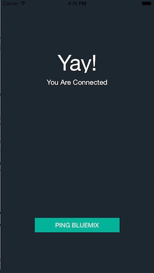

<!-- Attribute definitions -->
{:codeblock: .codeblock}
{:screen: .screen}

# HelloWorld サンプル入門
{: #gettingstarted-ios}
新規 iOS アプリを始める場合は、HelloWorld というアプリが使用できます。このアプリは、モバイル・アプリから {{site.data.keyword.Bluemix}} バックエンドへ認証を行わずに接続する方法を示す実例となっています。
このアプリには既に SDK がインストールされています。準備ができたら、アプリで使用したい特定のライブラリーが取得できます。

1. {{site.data.keyword.Bluemix_notm}} にモバイル・バックエンドを作成します。
<ol>
	<li>{{site.data.keyword.Bluemix_notm}} カタログの「ボイラープレート」セクションで、**「MobileFirst Services Starter」**をクリックします。</li>
    <li>アプリの名前とホストを入力して**「作成」**をクリックします。
</li>
    <li>**「完了」**をクリックします。</li>
</ol>
2. GitHub からプロジェクトを入手します。ご使用のコンピューターから、ターミナルを開いて次のコマンドを入力します。```
git clone https://github.com/ibm-bluemix-mobile-services/bms-samples-ios-helloworld```

3. プロジェクトを初期化します。SDK を初期化するために、以下のコードを Application Delegate の `didFinishLaunchingWithOptions` メソッドにコピーします。
   * Objective-C:

```
// initialize SDK with IBM Bluemix application ID and route
IMFClient *imfClient = [IMFClient sharedInstance];
[imfClient initializeWithBackendRoute:@"<insert route>" backendGUID:@"<insertGUID>"];
return YES;
```{: codeblock}
   * Swift:
```
// initialize SDK with IBM Bluemix application ID and route
IMFClient.sharedInstance().initializeWithBackendRoute("<insert route>", backendGUID: "<insertGUID>")
return true
```{: codeblock}

4. 開発環境でサンプルを実行します。Xcode で、**「Product」&gt;「Run」**をクリックします。iOS シミュレーターが開始します。シミュレーターで、**「{{site.data.keyword.Bluemix_notm}} を ping する」**をクリックします。サンプル・アプリが、Mobile Client Access サービスから許可ヘッダーを取得します。ping が成功した場合は、シミュレーター内のテキストが更新されます。
<br/>Xcode のモバイル・アプリから {{site.data.keyword.Bluemix_notm}} への接続に成功すると、「成功! つながりました(Yay! You are connected)」というメッセージが表示されます。<br/>
 への接続に成功<br/>接続に成功すると、デバッグ・ログイン Xcode に以下のメッセージが含まれます。
`「{{site.data.keyword.Bluemix_notm}} への接続に成功しました」`
5. 問題点があればすべて解決します。接続に失敗すると、「残念 不具合があります (Bummer Something went wrong)」というメッセージが表示されます。エラーの詳細が含まれます。<br/>

<br/>経路値と GUID 値を正しく貼り付けたことを検証してください。
   * Objective-C:

```
  [imfClient initializeWithBackendRoute:@"https://hellotest.mybluemix.net"
  backendGUID:@"9d48d73a-0878-4254-test-bdcbe6c79c31"];
  ``` {: codeblock}
   * Swift:
```
  IMFClient.sharedInstance().initializeWithBackendRoute("https://hellotest.mybluemix.net", backendGUID: "9d48d73a-0878-4254-test-bdcbe6c79c31")```{: codeblock}


デバッグ・ログで詳細を確認することもできます。

## 次のステップ:
{: #next}
SDK の取得方法および SDK とモバイル・アプリの統合方法については、{{site.data.keyword.Bluemix}} サービスのセットアップに関する情報を参照してください。
   * [Mobile Client Access](../../services/mobileaccess/index.html)
   * [プッシュ](../../services/mobilepush/index.html)

# 関連リンク

## サンプル
   * [HelloWorld (iOS)](https://github.com/ibm-bluemix-mobile-services/bms-samples-ios-helloworld)

## sdk
   * [bms-clientsdk-ios-core](https://github.com/ibm-bluemix-mobile-services/bms-clientsdk-ios-core)

## api
  *
[コア API](https://www.{DomainName}/docs/api/content/api/mobilefirst/ios/IMFCore_api-doc/html/index.html)
