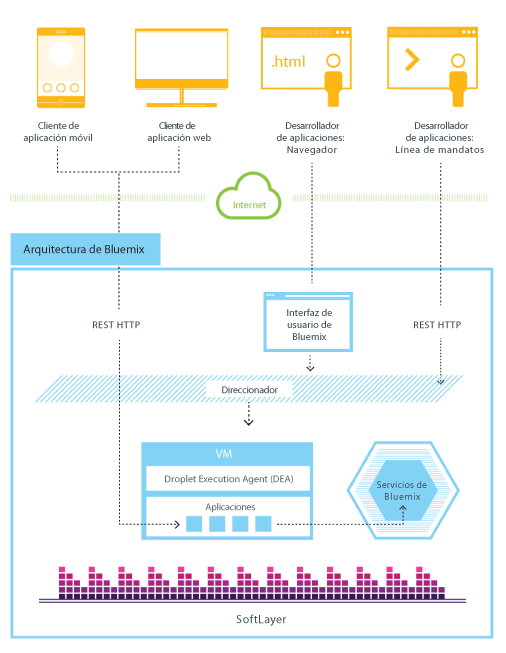
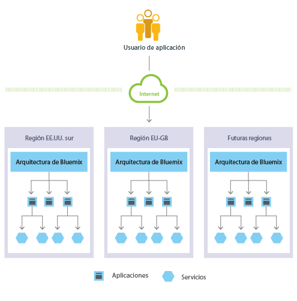
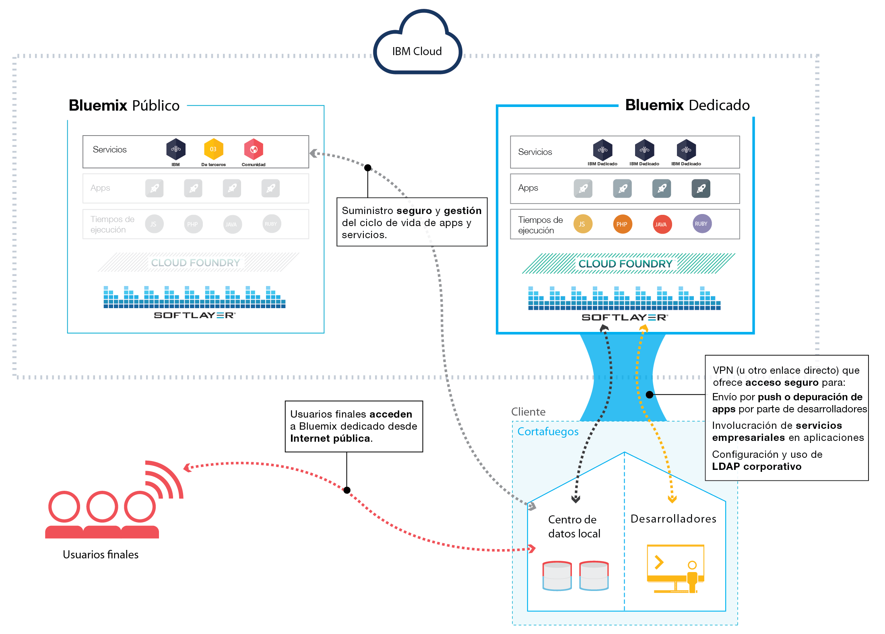
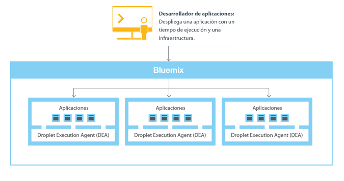
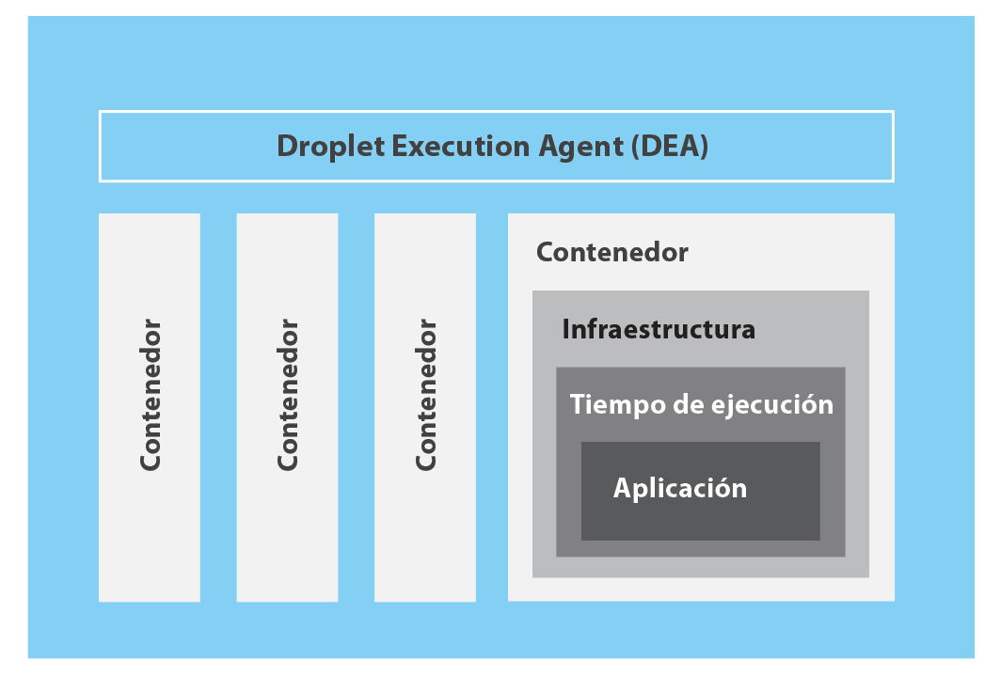
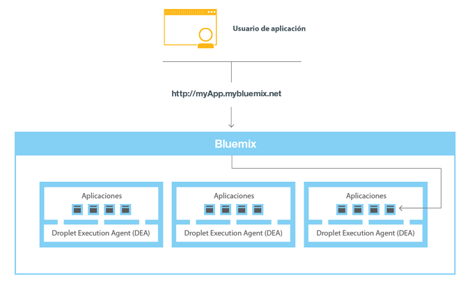

{:shortdesc: .shortdesc} 
{:new_window: target="_blank"}

# Visión general de {{site.data.keyword.Bluemix_notm}}
{: #overview}

*Última actualización: 15 de octubre de 2015*

{{site.data.keyword.Bluemix}} es la plataforma de nube abierta de {{site.data.keyword.IBM}} que proporciona a los desarrolladores de apps para móvil y web acceso al software de {{site.data.keyword.IBM_notm}} para funciones de integración, seguridad, transacción y otras funciones clave, así como a software de terceros.
{:shortdesc}

Basado en la tecnología de código abierto de [Cloud
Foundry](https://www.cloudfoundry.org/){: new_window}, {{site.data.keyword.Bluemix_notm}} facilita el desarrollo de aplicaciones con su oferta Plataforma como servicio
(PaaS). {{site.data.keyword.Bluemix_notm}} también ofrece funciones incorporadas de Programa de fondo móvil como servicio
(MBaaS).
El objetivo es simplificar la entrega de una aplicación proporcionando servicios que estén preparados para su uso inmediato y tengan capacidad para permitir el desarrollo a nivel de Internet.

{{site.data.keyword.Bluemix_notm}} también tiene despliegues de nube que se adaptan a sus necesidades. Tanto si pertenece a una empresa pequeña con perspectivas de crecimiento como si es miembro de una gran empresa que requiere aislamiento, disponemos la oferta adecuada, desarrolle en la nube sin límites, donde puede conectar sus dispositivos dedicados a los servicios {{site.data.keyword.Bluemix_notm}} públicos que ponen a su disponibilidad {{site.data.keyword.IBM_notm}} y otros proveedores. {{site.data.keyword.IBM_notm}} gestiona todas las instancias de servicio. El usuario recibirá una factura sólo por lo que utilice.

Con la amplia gama de servicios y tiempos de ejecución que se ofrece en {{site.data.keyword.Bluemix_notm}}, el desarrollador obtiene control y flexibilidad, y tiene acceso a diversas opciones de datos, desde el análisis predictivo hasta Big Data.

{{site.data.keyword.Bluemix_notm}} proporciona las siguientes características:

- Una amplia gama de servicios que permiten crear y extender rápidamente sus apps web y para móvil.
- Potencia de proceso para que pueda distribuir cambios en la aplicación continuamente.
- Modelos y servicios de programación adaptados a su finalidad.
- Funciones de gestión de servicios y aplicaciones.
- Cargas de trabajo optimizadas y elásticas.
- Disponibilidad continua.

{{site.data.keyword.Bluemix_notm}} abstrae y oculta la mayoría de las complejidades asociadas con el alojamiento y la gestión de aplicaciones basadas en la nube. Como desarrollador de aplicaciones, puede centrarse en desarrollar la aplicación sin tener que gestionar la infraestructura necesaria para alojarla. En el caso de apps para móvil y web, puede utilizar los servicios incorporados que proporciona {{site.data.keyword.Bluemix_notm}}.
Puede cargar la app en {{site.data.keyword.Bluemix_notm}} e indicar el número de instancias que desee tener en ejecución. Una vez desplegadas las apps, puede fácilmente escalarlas al alza o a la baja cuando cambie el uso o la carga de las apps.

Puede utilizar {{site.data.keyword.Bluemix_notm}} para desarrollar rápidamente apps en los lenguajes de programación más utilizados. Puede desarrollar apps para móvil en iOS, Android y HTML con JavaScript. Para las apps web, puede utilizar lenguajes como Ruby, PHP, Java&trade;, Go y Python. También puede migrar las apps existentes a {{site.data.keyword.Bluemix_notm}} y utilizar los tiempos de ejecución que proporciona {{site.data.keyword.Bluemix_notm}} para ejecutar sus apps.

{{site.data.keyword.Bluemix_notm}} también proporciona servicios de middleware para que los utilicen las apps. {{site.data.keyword.Bluemix_notm}} actúa en nombre de la aplicación cuando suministra nuevas instancias de servicio y luego enlaza estos servicios a la aplicación. La app puede llevar a cabo su trabajo real, dejando la gestión de los servicios a la infraestructura.

En general, no debe preocuparse de las capas de sistema operativo y de infraestructura cuando ejecute aplicaciones en {{site.data.keyword.Bluemix_notm}}. Las capas de tipo sistemas de archivos raíz y componentes de middleware se abstraen para que se pueda centrar en el código de la aplicación. Sin embargo, puede obtener más información sobre estas capas y necesita datos específicos sobre dónde se ejecuta la app. Consulte [Visualización de las capas de la infraestructura
de {{site.data.keyword.Bluemix_notm}}](../cli/viewinfra.html#viewinfra) para obtener más información. 

## Arquitectura de {{site.data.keyword.Bluemix_notm}}
{: #ov_arch}

Con {{site.data.keyword.Bluemix_notm}}, puede acceder a la plataforma pública de {{site.data.keyword.Bluemix_notm}}, configurar una plataforma dedicada de {{site.data.keyword.Bluemix_notm}} o ambos.

### {{site.data.keyword.Bluemix_notm}} público
{: #public}

Básicamente, {{site.data.keyword.Bluemix_notm}} es un entorno para que el usuario desarrolle apps y utilice servicios que ofrecen funciones fáciles de utilizar. {{site.data.keyword.Bluemix_notm}} también ofrece un entorno para alojar artefactos de aplicaciones que se ejecutan en un
servidor de aplicaciones, como por ejemplo Liberty. Mediante el uso de SoftLayer, {{site.data.keyword.Bluemix_notm}} despliega contenedores virtuales que contienen cada app desplegada. En este entorno, la app puede utilizar servicios incorporados (incluidos servicios de terceros) para facilitar el ensamblaje de la app. 

Como desarrollador, puede interactuar con la infraestructura de {{site.data.keyword.Bluemix_notm}} mediante una interfaz de usuario basada en navegador. También puede utilizar una interfaz de línea de mandatos de Cloud Foundry, denominada cf, para desplegar apps web.

Los clientes, que pueden ser apps móviles, las apps que se ejecutan externamente, las apps creadas en {{site.data.keyword.Bluemix_notm}} o los desarrolladores que utilizan navegadores interactúan con las apps alojadas en {{site.data.keyword.Bluemix_notm}}. Los clientes utilizan las API REST o HTTP para dirigir las solicitudes a través de {{site.data.keyword.Bluemix_notm}} a una de las instancias de la app o a los servicios compuestos.

La figura siguiente muestra la arquitectura de {{site.data.keyword.Bluemix_notm}} de alto nivel.

Arquitectura de 

*Figura 1. Arquitectura de {{site.data.keyword.Bluemix_notm}}*

Puede desplegar sus apps en distintas regiones de {{site.data.keyword.Bluemix_notm}}, por motivos de latencia o de seguridad. Puede elegir desplegar en una región o a lo largo de varias regiones. Para obtener más información, consulte [Regiones](overview.html#ov_intro__reg).



*Figura 2. Despliegue de aplicaciones en varias regiones*

### {{site.data.keyword.Bluemix_notm}} dedicado
{: #dedicated}

{{site.data.keyword.Bluemix_notm}} dedicado es su entorno de SoftLayer exclusivo que se conecta de forma segura a {{site.data.keyword.Bluemix_notm}} público y en su propia red. {{site.data.keyword.Bluemix_notm}} dedicado forma parte de su red con una conexión de red directa o VPN.
El hardware de un solo arrendatario se puede configurar en cualquier centro de datos de SoftLayer que exista. {{site.data.keyword.IBM_notm}} gestiona la plataforma dedicada y los servicios dedicados, de esta manera puede centrarse en crear apps personalizadas. Además, {{site.data.keyword.IBM_notm}} realiza todo el mantenimiento a instancias dedicadas durante una ventana de mantenimiento que haya seleccionado.

{{site.data.keyword.IBM_notm}} tiene varios servicios disponibles para su entorno dedicado pero puede conectarse a todos los servicios públicos. Todos los tiempos de ejecución están disponibles en el entorno dedicado.Los despliegues dedicados de {{site.data.keyword.Bluemix_notm}} incluyen los siguientes beneficios y características sin ningún coste adicional: VPN, VLAN privada, cortafuegos, conectividad con LDAP, optimización de las apps y bases de datos locales existentes, seguridad local 24 horas al día/7 días por semana, hardware dedicado y soporte estándar.  



*Figura 3. {{site.data.keyword.Bluemix_notm}} dedicado*

### {{site.data.keyword.Bluemix_notm}} local
{: #local}

{{site.data.keyword.Bluemix_notm}} local es su propia instancia de {{site.data.keyword.Bluemix_notm}} que se ha desplegado en su centro de datos, detrás del cortafuegos de la empresa. Con {{site.data.keyword.Bluemix_notm}} local, puede permanecer conectado de forma segura y sincronizado con {{site.data.keyword.Bluemix_notm}} público.

{{site.data.keyword.Bluemix_notm}} local incluye un catálogo privado y sindicado que muestra los servicios locales que están disponibles de forma exclusiva para el usuario. También incluye servicios sindicados disponibles que puede utilizar desde {{site.data.keyword.Bluemix_notm}} público. Todos los tiempos de ejecución están disponibles en el entorno local. Los despliegues locales de {{site.data.keyword.Bluemix_notm}} incluyen los siguientes beneficios y características sin ningún coste adicional: tecnología de gestión de relé, conectividad con LDAP, optimización de las apps y bases de datos locales existentes y soporte estándar.

IBM utiliza tecnología de relé para supervisar y mantener de forma segura el entorno, de forma que pueda seguir concentrado en el negocio. El relé es una prestación de entrega que se incluye con {{site.data.keyword.Bluemix_notm}} local que permite a IBM entregar actualizaciones de forma automática y coherente, de forma que tenga siempre un sistema seguro, estable y actualizado. El relé consigue conectividad mediante un túnel VPN y una SSL saliente que se origina a partir de la fase inicial de máquina virtual. Mediante este túnel, IBM sirve y mantiene la plataforma, calcula los recursos y servicios para la instancia. Consulte [{{site.data.keyword.Bluemix_notm}} local](../local/index.html#local).


*Figura 4. {{site.data.keyword.Bluemix_notm}} local*

### Funcionamiento de {{site.data.keyword.Bluemix_notm}}
{: #howwork}

Cuando despliega una app en {{site.data.keyword.Bluemix_notm}}, debe configurar {{site.data.keyword.Bluemix_notm}} con suficiente información para dar soporte a la app. 

* En el caso de una app para móvil, {{site.data.keyword.Bluemix_notm}} contiene un artefacto que representa el proceso de las apps para móvil, como por ejemplo los servicios que utiliza la app para móvil para comunicarse con un servidor. 
* En el caso de una app web, debe asegurarse de que esta información sobre el tiempo de ejecución y la infraestructura adecuados se comunique a {{site.data.keyword.Bluemix_notm}},
para que pueda configurar el entorno de ejecución correcto para ejecutar la app. 

Cada entorno de ejecución, que incluye tanto móvil como web, se aísla del entorno de ejecución de otras apps. Los entornos de ejecución se aíslan aunque estas apps estén en la misma máquina física. La figura siguiente muestra el flujo básico de cómo {{site.data.keyword.Bluemix_notm}} gestiona el despliegue de apps:  



*Figura 5. Despliegue de una app*

Cuando crea una app y la despliega en {{site.data.keyword.Bluemix_notm}}, el entorno de {{site.data.keyword.Bluemix_notm}} determina una máquina virtual (VM) adecuada a la que se envía la app o los artefactos que representa la app. En el caso de una app para móvil, se crea una proyección de proceso en {{site.data.keyword.Bluemix_notm}}.
Cualquier código de la app para móvil de la nube en principio se ejecuta en el entorno de {{site.data.keyword.Bluemix_notm}}.
En el caso de una app web, el código que se ejecuta en la nube es la propia app que el desarrollador despliega en {{site.data.keyword.Bluemix_notm}}.
La determinación de la VM se basa en varios factores, que incluyen los siguientes: 

* La carga que ya soporta la máquina
* Los tiempos de ejecución o infraestructuras que soporta esta VM. 

Después de seleccionar una VM, un gestor de aplicaciones de cada VM instala la infraestructura y el tiempo de ejecución adecuados para la app. A partir de entonces la app se puede desplegar en la infraestructura. Cuando se completa el despliegue, se inician los artefactos de la aplicación.

La siguiente figura
muestra la estructura de una VM, también conocida como agente de ejecución de gotas (DEA), en la que se han desplegado varias apps:  



*Figura 6. Diseño de una VM*

En cada VM, un gestor de aplicaciones se comunica con el resto de la infraestructura de {{site.data.keyword.Bluemix_notm}} y gestiona las apps que se despliegan en esta VM. Cada VM dispone de contenedores para separar y proteger las apps. En cada contenedor, {{site.data.keyword.Bluemix_notm}} instala la infraestructura y el tiempo de ejecución adecuados que necesita cada app.

Cuando se despliega la app, si tiene una interfaz web (como por ejemplo una app web Java) y otros servicios basados en REST (como por ejemplo servicios móviles expuestos públicamente para la app para móvil), los usuarios de la app pueden comunicarse con la misma mediante solicitudes HTTP normales.



*Figura 7. Invocación de una app de {{site.data.keyword.Bluemix_notm}}*

Cada app puede tener uno o varios URL asociados, pero todos deben apuntar al punto final de {{site.data.keyword.Bluemix_notm}}.
Cuando entra una solicitud, {{site.data.keyword.Bluemix_notm}} la examina, determina la app a la que va destinada y a continuación selecciona una de las instancias de la app para que reciba la solicitud.  

### Resiliencia de {{site.data.keyword.Bluemix_notm}}
{: #resiliency}

Se ha diseñado {{site.data.keyword.Bluemix_notm}}
para alojar aplicaciones y artefactos de apps resilientes y escalables
que puedan escalarse para cumplir sus necesidades, así como para ofrecer una alta disponibilidad
y una recuperación rápida de problemas. {{site.data.keyword.Bluemix_notm}} separa los componentes que realizan un seguimiento del estado de las interacciones (con estado)
de los que no (sin estado). Esta separación permite que {{site.data.keyword.Bluemix_notm}} pueda
trasladar apps de forma flexible según convenga para lograr escalabilidad y resiliencia.

Puede tener una o varias instancias en ejecución para la app. Si tiene varias instancias de una app, la app sólo se carga una vez. Sin embargo, {{site.data.keyword.Bluemix_notm}} despliega
el número de instancias de la app solicitada y las distribuye
a través del mayor número posible de máquinas virtuales.

Debe guardar todos los datos persistentes
en un almacén de datos con estado que se encuentre fuera de la app,
como por ejemplo en uno de los servicios de almacenamiento de datos proporcionados por {{site.data.keyword.Bluemix_notm}}.
Dado que es posible que algún elemento almacenado en la memoria caché o en el disco no esté disponible
incluso después de reiniciar, puede utilizar el espacio de memoria o sistema de archivos de una instancia
de {{site.data.keyword.Bluemix_notm}}
como caché rápida de transacción única. Con una sola configuración de instancia,
la solicitud a su app puede interrumpirse debido a la naturaleza sin estado
de {{site.data.keyword.Bluemix_notm}}.
Se recomienda utilizar como mínimo tres instancias para cada app
para garantizar la disponibilidad de la app.

La infraestructura de {{site.data.keyword.Bluemix_notm}}, todos los componentes de Cloud Foundry y los componentes de gestión específicos de {{site.data.keyword.IBM_notm}} tienen una alta disponibilidad. Se utilizan varias instancias de la infraestructura
para equilibrar la carga.

## Conceptos de {{site.data.keyword.Bluemix_notm}}
{: #ov_intro}

{{site.data.keyword.Bluemix_notm}} consta de aplicaciones, servicios, paquetes de compilación y otros componentes. Puede desplegar aplicaciones en distintas regiones de {{site.data.keyword.Bluemix_notm}} utilizando un ID de {{site.data.keyword.IBM_notm}}.

### Regiones
{: #ov_intro__reg}

Una región de {{site.data.keyword.Bluemix_notm}} es un territorio geográfico definido en el que puede desplegar sus apps. Puede crear apps e instancias de servicios en distintas regiones con la misma infraestructura de {{site.data.keyword.Bluemix_notm}} para la gestión de aplicaciones y la misma vista de detalles de uso para la facturación. Puede seleccionar la región se esté más cerca de sus clientes y desplegar sus apps a esta región para obtener una latencia baja de la aplicación. También puede seleccionar la región en la que desea conservar los datos de aplicación para solucionar los problemas de seguridad. Cuando crea apps en varias regiones, si una región queda fuera de servicio, las apps que están en las otras regiones seguirán funcionando.
Su concesión de recursos es la misma para cada región que utilice.

Si está utilizando la interfaz de usuario de {{site.data.keyword.Bluemix_notm}}, puede cambiar a una región distinta para trabajar con los espacios de esa región.

Si utiliza la interfaz de línea de mandatos cf, debe conectarse a la región {{site.data.keyword.Bluemix_notm}} con la que desea trabajar utilizando el mandato cf api y especificando el punto final API de la región. Por ejemplo, escriba el siguiente mandato para conectarse a la región de
{{site.data.keyword.Bluemix_notm}} de Europa - Reino Unido:

```
cf api https://api.eu-gb.{{site.data.keyword.Bluemix_notm}}.net
```

Si
utiliza las herramientas de Eclipse, debe conectarse a la región {{site.data.keyword.Bluemix_notm}}
con la que desea trabajar creando un servidor {{site.data.keyword.Bluemix_notm}}
y especificando el punto final API de la región. Para obtener más información
sobre el uso de las herramientas de Eclipse, consulte [Despliegue de apps con {{site.data.keyword.IBM_notm}} Eclipse Tools for {{site.data.keyword.Bluemix_notm}}](../manageapps/eclipsetools/eclipsetools.html#toolsinstall).

Cada región tienen asignado un prefijo exclusivo. {{site.data.keyword.Bluemix_notm}} proporciona las siguientes regiones y prefijos.  

<!-- PRODUCTION ONLY: Ensure that URLs are production URLs, not stage1-->

| **Nombre de la región** | **Prefijo de la región** | **Punto final cf API** | **Consola de interfaz de usuario** |       
|-----------------|-------------------|---------------------|----------------|
| Región EE.UU. sur | us-south | api.ng.{{site.data.keyword.Bluemix_notm}}.net | console.ng.{{site.data.keyword.Bluemix_notm}}.net |
| Región Europa Reino Unido | eu-gb | api.eu-gb.{{site.data.keyword.Bluemix_notm}}.net | console.eu-gb.{{site.data.keyword.Bluemix_notm}}.net |
| Región Australia Sídney | eu-gb | api.au-syd.{{site.data.keyword.Bluemix_notm}}.net | console.au-syd.{{site.data.keyword.Bluemix_notm}}.net |

*Tabla 1. Lista de regiones de {{site.data.keyword.Bluemix_notm}}*

### Infraestructura
{: #infrastructure}

{{site.data.keyword.Bluemix_notm}} ofrece tres maneras de ejecutar el código: Cloud Foundry, {{site.data.keyword.IBM_notm}} Containers y máquinas virtuales. Puede seleccionar la infraestructura derecha para desplegar sus apps.

<dl>
<dt>Cloud
Foundry</dt>
    <dd>Las apps que se ejecutan en la infraestructura de Cloud Foundry trabajan con las apps existentes de Cloud Foundry y se pueden enlazar a cualquier servicio que esté disponible en el catálogo de {{site.data.keyword.Bluemix_notm}}. Con esta infraestructura, podrá desarrollar y gestionar su código de aplicación y {{site.data.keyword.Bluemix_notm}} se encargará de la gestión y mantenimiento de la infraestructura que potencia estas apps.</dd>
<dt>{{site.data.keyword.IBM_notm}}Containers</dt>
    <dd>Con la infraestructura de {{site.data.keyword.IBM_notm}} Containers, puede ejecutar la app web en cualquier sitio donde se dé soporte al despliegue de contenedor. Un *contenedor* es un objeto que tiene todo lo necesario para ejecutar una app. Esta infraestructura incluye un registro privado de las imágenes de confianza, para que los pueda desplegar, almacenar y recuperar. Luego, las imágenes estarán disponibles en {{site.data.keyword.Bluemix_notm}} y podrá gestionar los contenedores en la plataforma. La infraestructura de {{site.data.keyword.IBM_notm}} Containers escala horizontal y verticalmente. Puede utilizar todas las imágenes disponibles en el Docker Hub público y utilizar la API de Docker y la interfaz de línea de mandatos para gestionar los contenedores en {{site.data.keyword.Bluemix_notm}}. {{site.data.keyword.IBM_notm}} también puede proporcionar imágenes públicas en el Containers Registry que puede utilizar y ampliar.

    Los {{site.data.keyword.IBM_notm}} Containers se utilizan para ejecutar contenedores de Docker en un entorno de nube alojado. Docker
añade un motor para desplegar una app al entorno virtual para ejecutar los contenedores. También proporciona un entorno para ejecutar el código. Cuando esté preparado, proporcionará los medios por los cuales transferir el código desde el entorno de desarrollo a su entorno de prueba y luego al entorno de producción.

    Para obtener más información sobre {{site.data.keyword.IBM_notm}} Containers, consulte [{{site.data.keyword.IBM_notm}} Containers](../containers/container_index.html) en la documentación Creación de apps web.</dd>
<dt>Máquinas virtuales (BETA)</dt>
    <dd>La infraestructura de máquinas virtuales de {{site.data.keyword.Bluemix_notm}} le facilita la creación y gestión de grupos de máquinas virtuales en la nube pública de {{site.data.keyword.IBM_notm}}. También puede crear y gestionar grupos de máquinas virtuales en aquellas nubes privadas de {{site.data.keyword.IBM_notm}} que haya decidido compartir con usuarios de {{site.data.keyword.Bluemix_notm}}. La infraestructura incluye instrucciones para conectarse a las infraestructuras locales. El soporte de supervisión y registro está integrado en {{site.data.keyword.Bluemix_notm}}.
Puede desplegar y gestionar sus máquinas virtuales mediante la interfaz de usuario de {{site.data.keyword.Bluemix_notm}} o bien con las API de OpenStack en la nube.     Las máquinas virtuales de {{site.data.keyword.Bluemix_notm}} da soporte al suministro de grupos de máquinas virtuales con escalado automático. Gracias a este soporte, se puede aumentar o disminuir automáticamente el número de instancias en función de la carga del CPU del error de una instancia. Además, también se da soporte al equilibrio de carga, que habilita la asignación de direcciones IP virtuales (IP flotantes) según se necesite.

    Para obtener más información sobre las máquinas virtuales de {{site.data.keyword.Bluemix_notm}}, consulte [Máquinas virtuales](../virtualmachines/vm_index.html) en la documentación Creación de apps web.</dd>
</dl>

### Aplicaciones
{: #applications}

En {{site.data.keyword.Bluemix_notm}},
una aplicación o *app* representa el artefacto que está creando un desarrollador. El ciclo de vida de una aplicación en {{site.data.keyword.Bluemix_notm}} y en Cloud Foundry es idéntico, independientemente de cómo envíe la app a {{site.data.keyword.Bluemix_notm}}.
Para obtener más información, consulte [Cómo se transfieren las aplicaciones](https://docs.cloudfoundry.org/concepts/how-applications-are-staged.html).

<dl>
<dt>Apps para móvil</dt>
    <dd>Las apps para móvil se ejecutan fuera del entorno de {{site.data.keyword.Bluemix_notm}} y utilizan los servicios a los que están expuestas las apps para móviles. Estos servicios generalmente actúan en sintonía y representan la proyección del proceso de dicha app. {{site.data.keyword.Bluemix_notm}} también puede alojar el código de la app que el desarrollador preferiría ejecutar en un servidor de proceso en un entorno basado en contenedor.</dd>
<dt>Apps web</dt>
    <dd>Las apps web constan de todo el código que se tiene que ejecutar o hacer referencia al mismo en el momento de la ejecución. Las apps web se cargan en {{site.data.keyword.Bluemix_notm}} para alojar la app. </dd>
</dl>

En el caso de lenguajes como Java, donde el código fuente se compila en archivos binarios de tiempo de ejecución, sólo es necesario cargar los archivos binarios.

### Servicios
{: #services}

Un *servicio* es una extensión de la nube alojada en {{site.data.keyword.Bluemix_notm}}.
El servicio proporciona funciones preparadas para que las utilice el código en ejecución de la app. Los servicios predefinidos que proporciona {{site.data.keyword.Bluemix_notm}} incluyen base de datos, mensajería, notificaciones push para apps para móvil y almacenamiento elástico en caché de apps web.

Puede crear sus propios servicios en {{site.data.keyword.Bluemix_notm}}.
La complejidad de estos servicios puede variar. Pueden ser sencillos programas de utilidad, como por ejemplo las funciones que puede ver en una biblioteca de tiempo de ejecución. También pueden ser una compleja lógica empresarial que puede ver en un servicio o base de datos de modelado de procesos empresariales.

{{site.data.keyword.Bluemix_notm}} simplifica el uso de servicios al suministrar nuevas instancias del servicio y enlazar dichas instancias del servicio con la app. {{site.data.keyword.Bluemix_notm}} maneja automáticamente la gestión del servicio.
Para ver todos los servicios disponibles en {{site.data.keyword.Bluemix_notm}}, consulte el catálogo en la interfaz de usuario de {{site.data.keyword.Bluemix_notm}}.

### Iniciadores
{: #starters}

Un *iniciador* es una plantilla que incluye servicios predefinidos y código de la app configurado con un determinado paquete de compilación. Hay dos tipos de iniciadores: contenedores modelo y tiempos de ejecución.Un iniciador puede ser código de app que se escribe en un lenguaje de programación específico, o una combinación de código de app y conjunto de servicios. 

### Contenedores modelo
{: #boilerplates}

En {{site.data.keyword.Bluemix_notm}}, un *contenedor modelo* contiene una app y su entorno de tiempo de ejecución y servicios predefinidos asociados para un determinado dominio. Puede utilizar un contenedor modelo para empezar a configurar y a ejecutar rápidamente. Por ejemplo, puede seleccionar el contenedor modelo Mobile Cloud para alojar apps móviles y web y acelerar el tiempo de desarrollo de los scripts del servidor utilizando la plantilla de app para móvil y SDK.

### Tiempos de ejecución
{: #runtimes}

Un *tiempo de ejecución* es el conjunto de recursos que se utiliza para ejecutar una app. {{site.data.keyword.Bluemix_notm}} proporciona entornos de tiempo de ejecución como contenedores para distintos tipos de apps. Los entornos de tiempo de ejecución están integrados como paquetes de compilación en {{site.data.keyword.Bluemix_notm}} y se configuran automáticamente.

### Paquetes de compilación
{: #buildpacks}

Un paquete de compilación es una colección de scripts que preparan el código para su ejecución en la PaaS de destino. Un paquete de compilación obtiene el tiempo de ejecución y las dependencias de la infraestructura de una app. A continuación, los empaqueta con la app en un droplet (gota) que se puede desplegar en la nube.

Si no especifica un paquete de compilación al desplegar la app en {{site.data.keyword.Bluemix_notm}}, se utilizan de forma predeterminada los paquetes de compilación incorporados.

<dl class="dl"><dt class="dt dlterm">Compilaciones incorporadas de {{site.data.keyword.IBM_notm}}</dt>
<dd class="dd"><div class="p">
<!-- begin PRODUCTION ONLY -->
La lista siguiente son las compilaciones incorporadas que ha creado
{{site.data.keyword.IBM_notm}}.
<ul>
<li>Liberty for Java</li>
<li>Node.js</li>
</ul>
<!-- end PRODUCTION ONLY -->
</div>
</div>
</dd>
<dt class="dt dlterm">Paquetes de compilación de la comunidad incorporados</dt>
<dd class="dd"><p class="p">En {{site.data.keyword.Bluemix_notm}}, también puede utilizar paquetes de compilación incorporados que ofrece la comunidad de Cloud Foundry. Para ver los paquetes de compilación incorporados de la comunidad, ejecute el mandato <span class="keyword cmdname">cf buildpacks</span>.</p>
</dd>
<dt class="dt dlterm">Paquetes de compilación externos</dt>
<dd class="dd"><div class="p">Si no encuentra el tiempo de ejecución o la infraestructura que desea en los paquetes de compilación incorporados que ofrece {{site.data.keyword.Bluemix_notm}}, puede incluir un paquete de compilación externo existente para que lo utilice su app.
La comunidad de Cloud Foundry proporciona paquetes de compilación externos para que los utilice como sus propios paquetes de compilación. El paquete de compilación se especifica al desplegar la app con el mandato <span class="keyword cmdname">cf push</span>. <div class="note note"><span class="notetitle">Nota:</span> {{site.data.keyword.IBM_notm}} no da soporte a paquetes de compilación externos;
por lo tanto, debe ponerse en contacto con la comunidad de
Cloud Foundry para obtener soporte.</div>
</div>
</dd>
</dl>


## Integración con sistemas de registros
{: #sor}

{{site.data.keyword.Bluemix_notm}} puede ayudar a los desarrolladores ya que conecta dos amplias categorías de sistemas en un entorno de nube: sistemas de registros y sistemas colaborativos.

Los *sistemas de registro* incluyen apps y bases de datos que almacenan registros empresariales y automatizan los procesos estandarizados. Los *sistemas colaborativos* ofrecen prestaciones que amplían la utilidad de los sistemas de registros y facilitan la colaboración por parte de los usuarios. Mediante la integración de un sistema de registros con la app que cree en {{site.data.keyword.Bluemix_notm}}, puede llevar a cabo estas acciones:

 * Permitir una comunicación segura entre la aplicación y la base de datos de fondo descargando e instalando un conector seguro local.
 * Invocar una base de datos de forma segura.
 * Crear API a partir de flujos de integración con bases de datos y sistemas de fondo, como por ejemplo un sistema de gestión de relaciones con los clientes.
 * Exponer únicamente los esquemas y las tablas que desea exponer a la aplicación.
 * Como gestor de la organización de {{site.data.keyword.Bluemix_notm}}, publicar una API como servicio privado que sea visible sólo para los miembros de su organización. 

Para integrar un sistema de registros con las aplicaciones que cree en {{site.data.keyword.Bluemix_notm}}, utilice el servicio de Cloud Integration. Utilizando el servicio de Cloud Integration, puede crear una API de Cloud Integration y publicar la API como un servicio privado para su organización.

<dl>
<dt>API de Cloud Integration</dt>
    <dd>Una API de Cloud Integration proporciona un acceso seguro a los sistemas de registro que residen detrás de un cortafuegos mediante las API web. Al crear la API de Cloud Integration, debe elegir el recurso al que desea acceder mediante la API web, especificar las operaciones que se permiten e incluye los SDK y ejemplos para acceder a la API. Para obtener más información sobre cómo crear una API de Cloud Integration, consulte [Creación de API de Cloud Integration](../services/CloudIntegration/index.html#cloudint_add_service).</dd>
<dt>Servicio privado</dt>
    <dd>Un servicio privado consiste en una API de Cloud Integration, los SDK y políticas de titularidad. Además, el servicio privado puede contener documentación u otros elementos del proveedor de servicios.
Sólo el gestor de la organización puede publicar una API de Cloud Integration como un servicio privado. Para ver los servicios privados que tiene disponibles, marque el recuadro de selección Privado en el catálogo de {{site.data.keyword.Bluemix_notm}}. Puede seleccionar y enlazar un servicio privado a una app sin conectarse al servicio de Cloud Integration. Los servicios privados se enlazan a su aplicación de la misma forma en que se hace en otros servicios de {{site.data.keyword.Bluemix_notm}}. Para obtener información sobre cómo publicar una API como un servicio privado, consulte Publicación de una API como un servicio privado.</dd>
	</dl>

### Caso de ejemplo: creación de una potente aplicación móvil para conectar con su sistema de registros
{: #scenario}

{{site.data.keyword.Bluemix_notm}} ofrece una plataforma en la que puede integrar su app para móvil, servicios de nube y sistemas de registros de la empresa a fin de proporcionar una aplicación que interactúe con los datos locales.

Por ejemplo, puede crear una app para móvil para interactuar con el sistema de gestión de relaciones con los clientes que reside de forma local detrás de un cortafuegos. Puede invocar el sistema de registros de manera segura y aprovechar los servicios móviles de {{site.data.keyword.Bluemix_notm}} para crear una potente aplicación móvil.

En primer lugar, el desarrollador de integración crea la aplicación móvil de fondo en {{site.data.keyword.Bluemix_notm}}. Utiliza el contenedor modelo de Mobile Cloud que usa el tiempo de ejecución Node.js con el que está más familiarizado.

A continuación, mediante el uso del servicio Cloud Integration en la interfaz de usuario de {{site.data.keyword.Bluemix_notm}}, expone una API a través de un conector seguro. El desarrollador de integración descarga el conector seguro y lo instala de forma local para permitir la comunicación segura entre su API y la base de datos. Después de crear el punto final de la base de datos, examina todos los esquemas y extrae las tablas que desea exponer como API ante la aplicación. 

El desarrollador de integración añade el servicio Push para enviar notificaciones móviles a los consumidores interesados. También añade un servicio de un business partner para iniciar un tweet cuando se crea un nuevo registro de cliente con una API
de Twitter.

A continuación, como desarrollador de la aplicación, puede iniciar una sesión en {{site.data.keyword.Bluemix_notm}},
descargar el kit de herramientas de desarrollo de Android y desarrollar código que invoque las API que ha creado el desarrollador de integración. Puede desarrollar una aplicación móvil que permita a los usuarios entrar la información en su dispositivo móvil. Luego la app para móvil crea un registro de cliente en el sistema de gestión de clientes. Cuando se crea el registro, la aplicación envía una notificación a un dispositivo móvil e inicia un tweet sobre el nuevo registro.

## Soporte multilingüístico para {{site.data.keyword.Bluemix_notm}}
{: #lang}

{{site.data.keyword.Bluemix_notm}} da soporte a idiomas nacionales que no sean el inglés. Sin embargo, no todo el contenido que se suministra
con {{site.data.keyword.Bluemix_notm}} está
traducido.La siguiente tabla lista los idiomas nacionales soportados y los códigos de idiomas de {{site.data.keyword.Bluemix_notm}}.

| **Idioma nacional** | **Código de idioma** |
|-------------------|---------------|
| Portugués de Brasil | pt_BR |
| Inglés | en |
| Francés | fr |
| Alemán | de |
| Japonés | ja |
| Coreano | ko |
| Italiano | it |
| Español | es |
| Chino simplificado | zh_CN |
| Chino tradicional | zh_TW |

*Tabla 3. Idiomas nacionales soportados y códigos de idioma*

# rellinks
## general 
* Requisitos previos de [{{site.data.keyword.Bluemix_notm}}](https://developer.ibm.com/bluemix/support/#prereqs)
* [Novedades de {{site.data.keyword.Bluemix_notm}}](../whatsnew/index.html)
* Problemas conocidos de [{{site.data.keyword.Bluemix_notm}}](https://developer.ibm.com/bluemix/support/#issues)
* Glosario de [{{site.data.keyword.Bluemix_notm}}](/glossary/glossary.html)
* Hoja de precios de [{{site.data.keyword.Bluemix_notm}}](https://console.{{site.data.keyword.domainname}}/pricing/)
* [{{site.data.keyword.Bluemix_notm}}DevOps Services](https://hub.jazz.net)
* [Cloud
Foundry](http://cloudfoundry.org/)
* [SoftLayer, una empresa de {{site.data.keyword.IBM_notm}}](http://www.softlayer.com/)
