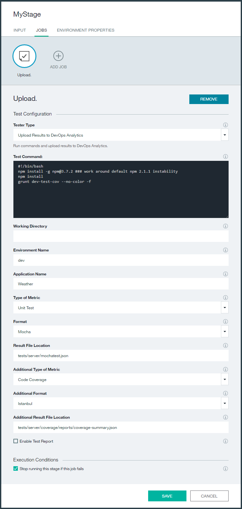
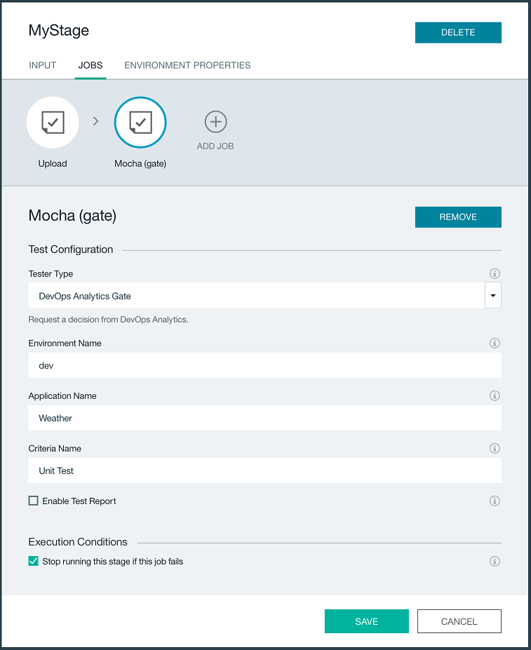

---

copyright:
  years: 2016

---

{:new_window: target="_blank"}
{:shortdesc: .shortdesc}
{:screen: .screen}
{:codeblock: .codeblock}
{:pre: .pre}

# Configuring the {{site.data.keyword.deliverypipeline}}
{: #DRA_toolchain_configure_pipeline}

*Last updated: 24 May 2016*

After you define the criteria for {{site.data.keyword.DRA_short}} to monitor, the next step is to add {{site.data.keyword.DRA_short}} to a toolchain and then configure the {{site.data.keyword.deliverypipeline}}.
{:shortdesc}

{: #DRA_toolchain_integration}
To use {{site.data.keyword.DRA_short}}, add it to any toolchain that uses the {{site.data.keyword.deliverypipeline}}.

1. On the {{site.data.keyword.Bluemix_notm}} DevOps dashboard, on the **Toolchains** tab, click the toolchain to open its Tool Integrations page.

2. Click the add (+) button.

3. In the Tool Integrations section, select **{{site.data.keyword.DRA_short}}**

4. Click **Create Integration**.

5. In your toolchain, click the **{{site.data.keyword.deliverypipeline}}** tile that you would like to configure.  {{site.data.keyword.DRA_short}} can be configured in any number of pipelines.

## Updating test jobs for {{site.data.keyword.DRA_short}}
{: #DRA_toolchain_pipeline_upload}

1. To get started, retrieve the setup information from an existing testing job.

	1. On the stage that contains a test job, click the **Stage Configuration** icon . Click **Configure Stage**. 
	2. Select a Test job that uses the **Simple** Tester Type and copy the information that is in the **Test Command** and **Working Directory** fields to an editor.  This information will be used later in the configuration.

2. From the same **Simple** test job, change the Tester Type to **Upload Results to DevOps Analytics** from the drop down menu.
3. In the **Test Command** field, paste the commands that you copied from the **Test Command** field of the **Simple** test job.
4. In the **Working Directory** field, paste the path that you copied from the **Working Directory** field of the **Simple** test job.
5. Complete the next five fields to upload test results for a particular test type.

 * Environment Name
 * Application Name
 * Type of Metric
 * Format
 * Result File Location
 
**Note:** The **Type of Metric** and **Result File Location** specified must match the correct **Format**.

| Type of metric | Supported formats |
|----------------|-------------------|
| Functional Verification Test | Mocha, JUnit |
| Unit Test | Mocha, JUnit, Karma / Mocha |
| Code Coverage | Istanbul, Blanket.js |

**Optional:** To upload results for a second test type within the same job, complete the remaining fields that are prefixed with *Additional*.

* Additional Type of Metric
* Additional Format
* Additional Result File Location

Click **Save** to return to the pipeline.

*Figure 1* shows a test job that is configured to run Unit Tests, then upload the results in the Mocha format as well as Code Coverage results in the Istanbul format."

*Figure 1. Upload results to DevOps Analytics*

## Defining {{site.data.keyword.DRA_short}} gates in the pipeline.
{: #DRA_toolchain_pipeline_gates}

{{site.data.keyword.DRA_short}} Gates will check whether your test results comply with the defined criteria. If the criteria is not met, the {{site.data.keyword.DRA_short}} Gate will fail.  Usually, gates are placed at the end of each stage of your pipeline. This location is ideal to check the quality of the build against your criteria to ensure that it is safe to promote from one environment to another. However, you can put gates anywhere in the pipeline where you want a specific criteria to be checked.

1. On a stage, click the **Stage Configuration** icon  and click **Configure Stage**.
2. Click **Add Job**. For the job type, select **Test**.
3. Enter a name for the new job, such as *Gate (Unit Test)*.
4. For tester type, select **DevOps Analytics Gate**.
5. Specify the environment name and application name.  These values should match what was defined in your [testing jobs](#DRA_toolchain_pipeline_upload).
6. Define the criteria name that is to be checked at this gate.

 **note:** This name must exactly match one of the criteria names that was defined in the Criteria UI.  Also, you can only specify criteria that has been defined in the same {{site.data.keyword.Bluemix_notm}} organization as your toolchain.

7. **Optional** To make a gate function in advisory mode, uncheck the **Stop running this stage if this job fails** checkbox.  {{site.data.keyword.DRA_short}} will perform the same criteria analysis at the gate and generate reports, but it will not halt the pipeline in the event of a failure.
8. Click **Save** to return to the pipeline.
9. Repeat these steps to set up gates for all of your {{site.data.keyword.DRA_short}} criteria.

*Figure 2. DevOps Analytics Gate*

After your pipeline has been configured, see [Running the Delivery Pipeline](./pipeline_decision_reports.html#DRA_toolchain_reports) to start using {{site.data.keyword.DRA_short}}.