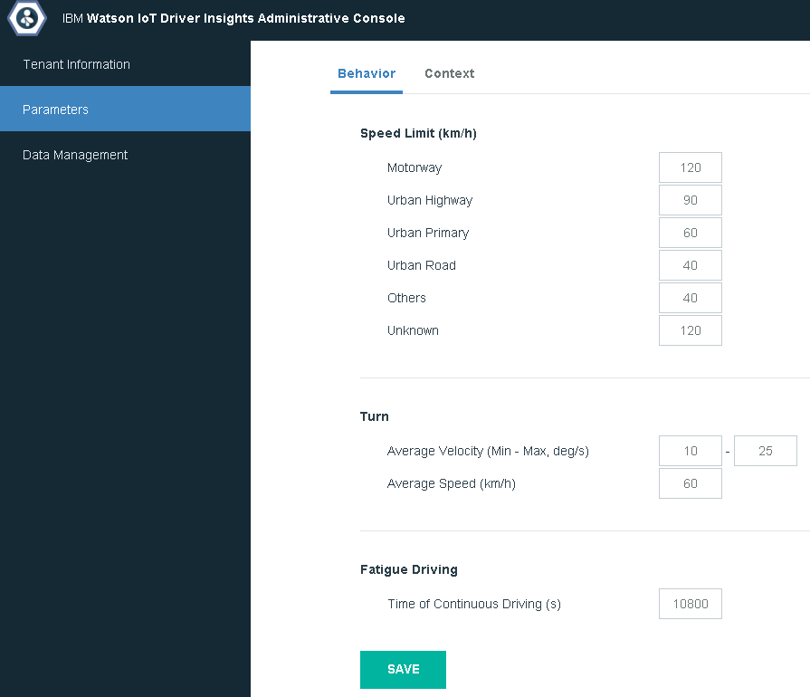
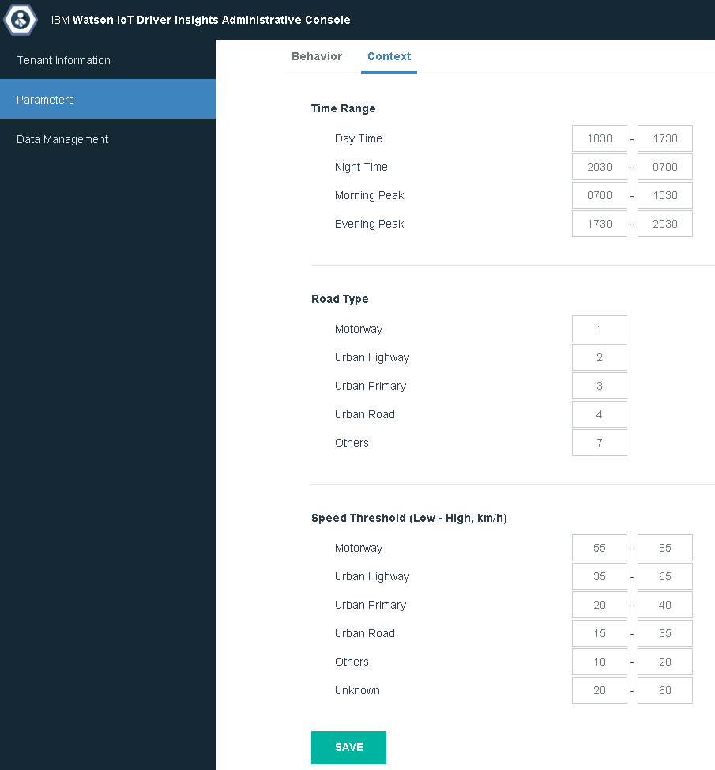

---

copyright:
  years: 2016

---

{:new_window: target="_blank"}
{:shortdesc: .shortdesc}
{:codeblock: .codeblock}
{:screen: .screen}
{:pre: .pre}

# About {{site.data.keyword.iotdriverinsights_short}}
{: #iotdriverinsights_overview}

You can use {{site.data.keyword.iotdriverinsights_full}} to analyze driver's behavior from vehicle probe data and contextual data.
{:shortdesc}

## {{site.data.keyword.iotdriverinsights_full}}
{: #iotdriverinsights_concept}

### Driver behavior analysis
You can analyze driver behavior such as anxious acceleration/brake, frequent brake, over speed, sharp turn and so on from vehicle probe data and contextual data.

 - Driving Behaviors 
    - Speed related
       - Anxious Acceleration
       - Harsh Brake
       - Over Speed
       - Frequent Stop
       - Frequent Acceleration
       - Frequent Brake
    - Turn related
       - Sharp Turn (High Speed Turn)
       - Acceleration Before Turn
       - Brake-Out Turn
    - Others
       - Fatigue Driving (Tired Driving)
 - Driving Context
    - Time Range
       - Morning Peak
       - Evening Peak
       - Day
       - Night
    - Road Type
       - Motorway
       - Urban Highway
       - Urban Primary
       - Urban Road
       - Others
    - Speed Pattern based on Road Type
       - Free Flow
       - Steady Flow
       - Congestion
       - Severe Congestion
       - Mixed Condition

### Big data analysis infrastructure
{{site.data.keyword.iotdriverinsights_full}} adopts Hadoop system as the backend infrastructure to realize high scalability for analyzing big data from vehicle probe data and contextual data.

### REST API
Developers can retrieve the analysis results by REST API and use them in the {{site.data.keyword.Bluemix_notm}} application.
 1. Vehicle Data
   - Send Vehicle Probe Data: Sends the vehicle probe data to be analyzed
   - Get Vehicle Probe Data List as Date: Returns the list of vehicle probe data by date basis
   - Delete Vehicle Probe Data List by Date: Deletes the vehicle probe data
 2. Analysis Job
   - Send Job Request:	Sends the driving behavior analysis job request
   - Get Job Information:	Returns the information of the specified job
   - Get Job Information: List	Returns the list of job information
 3. Analysis Result 
   - Get Analyzed Trajectory Summary List:	Returns the list of analyzed trajectory summary information
   - Get Analyzed Trajectory Information:	Returns the information of specified analyzed trajectory
   - Delete Job Result: Deletes all of analyzed result related to a job

### Configurability
Some of analysis threshold parameters (such as speed range per road type, turn angle range and so on) are allowed to configure as you like from UI (User Interface).

|Sample1|Sample2|
|---|---|
|||
