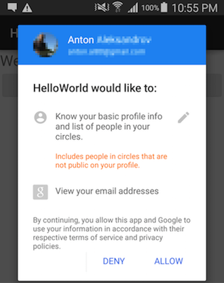

# Enabling Google authentication in Cordova apps
{: #google-auth-cordova}
In order to configure Cordova applications for Google authentication integration you must make changes in the native code of the Cordova application, for example in Java, Objective-C, Swift. Each platform must be configured separately. Use the native development environment to make changes in the native code, for example, in Android Studio or Xcode.

## Before you begin
{: #before-you-begin}
* You must have a resource that is protected by {{site.data.keyword.amashort}} and a Cordova project that is instrumented with {{site.data.keyword.amashort}} Client SDK.  For more information, see [Getting started with {{site.data.keyword.amashort}}](getting-started.html) and [Setting up the Cordova plug-in](getting-started-cordova.html).  
* Manually protect your backend application with {{site.data.keyword.amashort}} Server SDK. For more information, see [Protecting resources](protecting-resources.html).
* (optional) Get familiar with the following sections:
   * [Enabling Google authentication in Android apps](google-auth-android.html)
   * [Enabling Google authentication in iOS apps](google-auth-iOS.html)


## Configuring the Android Platform
{: #google-auth-cordova-android}

The steps required to configure Android Platform of a Cordova application for Google authentication integration are very similar to the steps required for native applications. For more information, see [Enabling Google authentication in Android apps](google-auth-android.html). Set up the following pieces:

* Configuring Google Project for Android Platform
* Configuring {{site.data.keyword.amashort}} for Google authentication
* Configuring {{site.data.keyword.amashort}} Client SDK for Android

The only difference when you are configuring Cordova applications is that you must initialize the {{site.data.keyword.amashort}} Client SDK in your JavaScript code instead of in the Java code. The `GoogleAuthenticationManager` API must still be registered in your native code.

## Configuring the iOS Platform
{: #google-auth-cordova-ios}

The steps required to configure iOS Platform of Cordova application for Google authentication integration are similar to the steps for native applications. The major difference is that currently Cordova CLI does not support the CocoaPods dependency manager.  You must manually add the required files for integrating with Google authentication. For more information, see  [Enabling Google authentication in iOS apps](google-auth-ios.html). Complete the following steps:

* Configuring Google Project for iOS Platform
* Configuring {{site.data.keyword.amashort}} for Google authentication

### Manually installing the {{site.data.keyword.amashort}} SDK for Google authentication and Google SDK
{: #google-auth-cordova-ios-sdk}
1. Download the archive containing [{{site.data.keyword.Bluemix}} Mobile Services SDK for iOS](https://hub.jazz.net/git/bluemixmobilesdk/imf-ios-sdk/archive?revstr=master)

1. Go to the `Sources/Authenticators/IMFGoogleAuthentication` directory and copy (drag and drop) all of the files to your iOS project in Xcode. The files you need to copy are:

	> * IMFDefaultGoogleAuthenticationDelegate.h
	> * IMFDefaultGoogleAuthenticationDelegate.m
	> * IMFGoogleAuthenticationDelegate.h
	> * IMFGoogleAuthenticationHandler.h
	> * IMFGoogleAuthenticationHandler.m

Select the **Copy files....** checkbox.

1. Download and install [Google+ iOS SDK](http://goo.gl/9cTqyZ).

1. Follow Step 2 of [Start integrating Google+ into your iOS app](https://developers.google.com/+/mobile/ios/getting-started) tutorial to integrate Google+ iOS SDK into your Xcode project

Continue to the **Configuring iOS project for Google Authentication** section of [Configuring iOS Platform for Google authentication](google-auth-ios.html). Register the `IMFGoogleAuthenticationHandler` in native code as described in the `Initializing the {{site.data.keyword.amashort}} Client SDK` section. You don't need to initialize `IMFClient` in your native code, this will be done in JavaScript code shortly.

Add the following line to the `application:openURL:sourceApplication:annotation` method of your application delegate. This line ensures that all Cordova plug-ins are notified of respective events.

```
[[ NSNotificationCenter defaultCenter] postNotification:
		[NSNotification notificationWithName:CDVPluginHandleOpenURLNotification object:url]];      
```

## Initializing the {{site.data.keyword.amashort}} Client SDK
{: #google-auth-cordova-initialize}

Use the following JavaScript code in your Cordova application to initialize the {{site.data.keyword.amashort}} Client SDK.

```JavaScript
BMSClient.initialize("applicationRoute", "applicationGUID");
```

Replace the *applicationRoute* and *applicationGUID* values with values the values that you obtained from **Mobile Options** section of your application on the dashboard.

## Testing the authentication
{: #google-auth-cordova-test}
After the Client SDK is initialized, you can start making requests to your mobile backend.

### Before you begin
{: #google-auth-cordova-testing-before}
You must be using the {{site.data.keyword.mobilefirstbp}} boilerplate and already have a resource protected by {{site.data.keyword.amashort}} at the `/protected` endpoint. If you need to set up a `/protected` endpoint, see [Protecting resources](protecting-resources.html).


1. Try to send a request to protected endpoint of your mobile backend in your desktop browser by opening `http://{appRoute}/protected`, for example `http://my-mobile-backend.mybluemix.net/protected`

1. The `/protected` endpoint of a mobile backend created with MobileFirst Services Boilerplate is protected with {{site.data.keyword.amashort}}, therefore it can only be accessed by mobile applications instrumented with {{site.data.keyword.amashort}} Client SDK. As a result you will see `Unauthorized` in your desktop browser.

1. Use your Cordova application to make request to the same endpoint. Add the below code after you initialize `BMSClient`

	```JavaScript
	var success = function(data){
    	console.log("success", data);
    }
	var failure = function(error)
    	{console.log("failure", error);
    }
	var request = new MFPRequest("/protected", MFPRequest.GET);
	request.send(success, failure);
	```


1. Run your application. The Google Login screen pops up.

	 &nbsp;&nbsp;&nbsp;&nbsp;&nbsp;&nbsp;&nbsp;&nbsp;&nbsp;	
	This screen might look slightly different if you do not have the Facebook app installed on your device, or if you are not currently logged in to Facebook.
1. By clicking **OK** you're authorizing {{site.data.keyword.amashort}} to use your Google user identity for authentication purposes.

1. 	Your request should succeed. Depending on a platform you're using you should see the following output in LogCat/Xcode console

	

	
