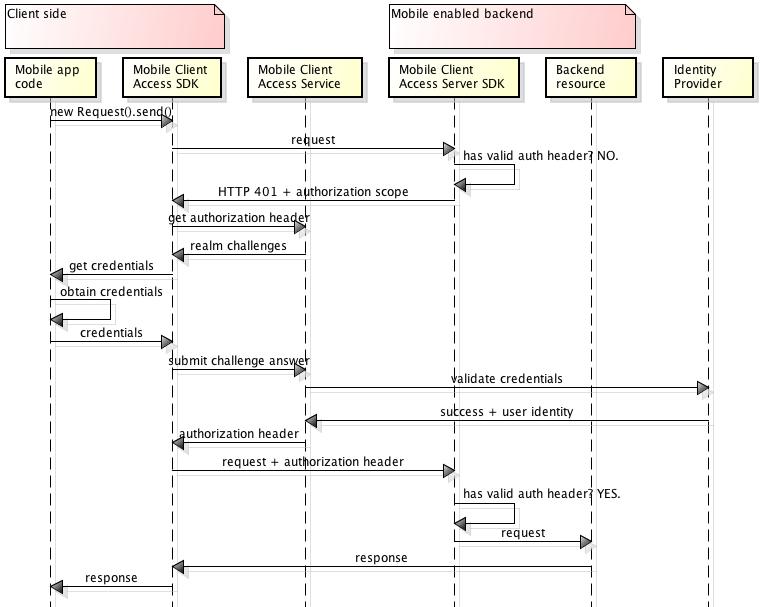

# {{site.data.keyword.amashort}} overview
{: #mca-overview}

The {{site.data.keyword.amafull}} service provides authentication and monitoring services for mobile applications that access cloud resources hosted on {{site.data.keyword.Bluemix_notm}}.

You can use the {{site.data.keyword.amashort}} service to protect Node.js and Java for Liberty applications that are hosted on {{site.data.keyword.Bluemix_notm}} with various authentication types. By instrumenting your mobile applications with {{site.data.keyword.amashort}} SDK, you can use the authentication capabilities that are provided by {{site.data.keyword.amashort}} service. Monitoring and client-side logs data are gathered automatically and sent to the {{site.data.keyword.amashort}} service on demand. Use the {{site.data.keyword.amashort}} dashboard to configure the various authentication types and see data that is gathered by the client-side SDK.

**Note**: The {{site.data.keyword.amashort}}  service was previously known as Advanced Mobile Access.

## {{site.data.keyword.amashort}} components
{: #components}

* **{{site.data.keyword.amashort}} dashboard**: Configure various authentication types and monitor mobile application performance, analytics, usage statistics, and device logs.
* **{{site.data.keyword.amashort}} Client SDK**: Instrument mobile applications to use {{site.data.keyword.amashort}}  functionality. Supported platforms are: iOS 8+, Android 4+, Cordova.
* **{{site.data.keyword.amashort}} Server SDK**: Protect resources that are hosted on {{site.data.keyword.Bluemix_notm}}. Currently supported runtimes are Node.js and Java for Liberty.

## Authentication types
{: #authtypes}
You can use the following types of authentication in your mobile app:
* **Facebook**: Use Facebook as an identity provider. Your users log in to the mobile app with their Facebook credentials.
* **Google**: Use Google as an identity provider. Your users log in to the mobile app with their Google+ credentials.
* **Custom**: Create your own identity provider. You fully control what kind of information is gathered and validated.

## {{site.data.keyword.amashort}}  architecture overview
{: #architecture}

* Protect your cloud resources (Node.js applications) with {{site.data.keyword.amashort}} the Server SDK.
* Use the `Request` class provided by the {{site.data.keyword.amashort}}  Client SDK to communicate with your protected cloud resources.
* The {{site.data.keyword.amashort}} Server SDK detects an unauthorized request and returns HTTP 401 authorization challenge.
* The {{site.data.keyword.amashort}} Client SDK detects HTTP 401 Authorization challenge and automatically starts authentication process with the {{site.data.keyword.amashort}}  service.
* Facebook, Google or Custom authentication is used  to authenticate.
* After successful authentication, {{site.data.keyword.amashort}} returns an authorization token.
* The {{site.data.keyword.amashort}} Client SDK automatically adds the authorization token to the original request and re-sends the request to the cloud resource.
* The {{site.data.keyword.amashort}}  Server SDK extracts the accessToken from the request and validates it with the {{site.data.keyword.amashort}} service.
* Access is granted.  The response is returned to the mobile application.

## {{site.data.keyword.amashort}} request flow
{: #flow}
The following diagram describes how a request flows from the SDK to your mobile backend and identity providers.

1. Use {{site.data.keyword.amashort}} SDK to make a request to your backend resources that are protected with the {{site.data.keyword.amashort}} Server SDK.
* The {{site.data.keyword.amashort}} Server SDK detects an unauthorized request and returns HTTP 401 + authorization scope.
* The {{site.data.keyword.amashort}} Client SDK automatically detects the HTTP 401 and starts the authentication process.
* The {{site.data.keyword.amashort}} Client SDK contacts the {{site.data.keyword.amashort}} service and asks to issue an authorization header.
* The {{site.data.keyword.amashort}} service asks the client app to authenticate first by supplying an authentication challenge according to the currently configured authentication type.
* The {{site.data.keyword.amashort}} Client SDK either:
   *  **Facebook or Google authentication:** Automatically processes the authentication challenge (for Facebook or Google authentication)
   * **Custom authentication**:Obtains credentials based on logic provided by the developer.
* If Facebook or Google authentication is configured, the {{site.data.keyword.amashort}} Client SDK uses the associated SDK to obtain Facebook or Google access tokens. These tokens serve as the authentication challenge response.
* If Custom authentication is configured, the developer must obtain the authentication challenge answer and supply it to {{site.data.keyword.amashort}} Client SDK.
* After the authentication challenge answer is obtained, it is sent to the {{site.data.keyword.amashort}} service.
* The service validates authentication challenge answer with a respective identity provider (Facebook/Google/Custom).
* If validation is successful, the {{site.data.keyword.amashort}} service generates an authorization header and returns the header to the {{site.data.keyword.amashort}} Client SDK. The authorization header contains two tokens: an access token that contains access permissions information, and an ID token that contains information about the current user, device, or application.
* From this point on, all requests made with {{site.data.keyword.amashort}} Client SDK have a newly obtained authorization header.
* The {{site.data.keyword.amashort}} Client SDK automatically resends the original request that triggered the authorization flow.
* The {{site.data.keyword.amashort}} Server SDK extracts the authorization header from request, validates the header with the  {{site.data.keyword.amashort}} service, and grants access to a backend resource.
