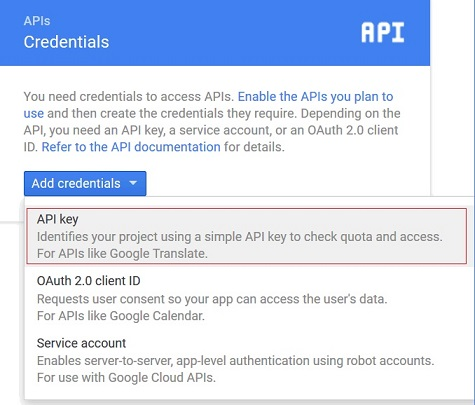
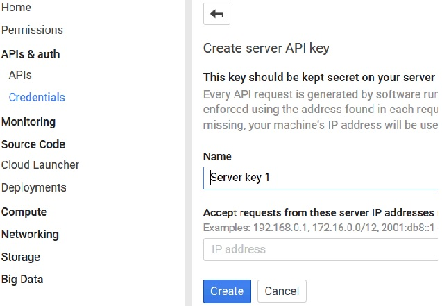

---

copyright:
 years: 2015, 2016

---

{:new_window: target="_blank"}
# Configuring credentials for Google cloud messaging (GCM)
{: #create-push-enable-gcm}

Get your Google Cloud Messaging (GCM) credentials, and then set up the Push Notification Service on the Push Dashboard.

##Getting Your Sender ID and API key

The API key is stored securely and used by the Push Notification Service to connect to the GCM server and the sender ID (project number) is used by the Android SDK on the client side.

1. Get a Google Development account at [Google Dev Console](https://console.developers.google.com/start){: new_window}. For more information about Google Cloud Messaging (GCM), see [Creating a Google API Project](https://developers.google.com/console/help/new/){: new_window}.

2. On the Google Developers Console, create a new project. For example, "hello world".

	

3. In **Project name**, enter the name of your project and then click the **Create** button.
4. Click **Home** to view the project number. Document your project number.

	

	**Note**: When you create your project, a project number (sender ID) is created. Use this number to set up the Push Notification Service on the Push dashboard screen.

5. Click the **APIs & Auth** and in the **Mobile APIs** section, click **Cloud Messaging for Android**.

	

6. Click **APIs** and then click the **Enable API** button to create your API Key for your project.

	

7. Go to the **APIs & Auths -> Credentials** screen. Click **Add Credentials** and then click **API Key**.

	

8. Click the **Server Key** option to generate a GCM API key that you'll use on the Bluemix Push dashboard.
9. In the **Name** field, enter the name of the server API key.

	

10. Click the **Create** button. 
The API key is displayed.

	

11. Copy your GCM API key and then click the **OK** button. You'll need the project number (Sender ID) and API key to configure your credentials on the Bluemix Push Notification Dashboard Configuration screen. 
12. Next Steps. Setting up the Push Notification Service for Android.

##Setting up the Push Notification Service for Android

**Before you begin**

Get a GCM API Key and Sender ID (project number). 

1. Open your backend application in the Bluemix dashboard and then click the IBM Push Notifications service to open the Push Notification Service dashboard.
 
	

	The Push dashboard is displayed.
	
	

2. Click the **Setup Push** button, to configure the GCM credentials.
1. On the **Configuration** tab, go to **Google Cloud Messaging** section and configure the Sender ID (GCM project number) and API Key.

4. Click the **Save** button. 
5. Next steps. [Enabling notifications for Android](c_enable_push.html).
