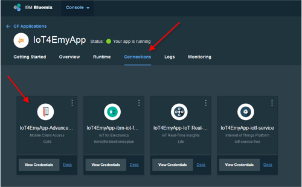
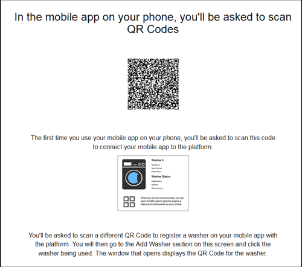

---

copyright:
  years: 2016

---
<!-- Copyright info at top of file: REQUIRED
    The copyright info is YAML content that must occur at the top of the MD file, before attributes are listed.
    It must be --- surrounded by 3 dashes ---
    The value "years" can contain just one year or a two years separated by a comma. (years: 2014, 2016)
    Indentation as per the previous template must be preserved.
-->

<!-- Common attributes used in the template are defined as follows: -->
{:new_window: target="_blank"}
{:shortdesc: .shortdesc}
{:screen:.screen}
{:codeblock:.codeblock}

<!-- Additional task topic: OPTIONAL
This is the template for additional task topics that are needed beyond the basic tasks in the getting started index.md.  As needed, other task topics can be included, with titles such as "Configuring x", "Administering y", "Managing z", etc. This topic is a peer of the getting started index.md in the <servicename>.ditamap. This topic can have one level of children and they also can be referenced in <servicename>.ditamap -->

# Getting started with the mobile app
{: #iot4e_getting_started_mobile}
*Last updated: 03 May 2016*

<!-- The short description section should include a sentence describing why this task is needed. For search engine optimization, include the service long name and "Bluemix". For example: -->

Get started with the {{site.data.keyword.iotelectronics_full}} mobile app to see how you can receive alerts, send commands, and check the status of your connected appliances.
{:shortdesc}

Complete the following tasks:
  - [Download the mobile app](#iot4e_downloadmobile)
  - [Configure {{site.data.keyword.amafull}}](#iot4e_configureMCA)
  - [Connect your mobile device to the Starter app](#iot4e_connecting_mobile)
  - [Register and control an appliance on your mobile device](#iot4e_adding_appliance)

 ## Downloading the mobile app
 {: #iot4e_downloadmobile}
 To get the mobile app, download and install it on your phone from the Apple App store.  On your phone, open the App store and search for "ibm iot". Choose **IBM IoT for Electronics** and install.

 Alternatively, you can install it to your phone by using [iTunes](https://itunes.apple.com/us/app/ibm-iot-for-electronics/id1103404928?ls=1&mt=8).

## Configuring the solution
{: #iot4e_configureMCA}

Before you can connect the mobile app, you must configure {{site.data.keyword.amafull}}.  

  1. From the **Connections** tab within your {{site.data.keyword.iotelectronics}}, open the {{site.data.keyword.amashort}} application. (You can also access the application from your Bluemix dashboard.)  

    

  2. Under **Custom**, click **Configure**.  
     
  3. Enter the following authentication credentials:
    - **Realm name** - Enter **myRealm**.
    - **URL** - Enter the URL to identify your {{site.data.keyword.iotelectronics}} Starter app in the following format: **https://<*myIoT4eStarterApp*>.mybluemix.net**  

      **Tip:** Be sure to use the secure "https://" prefix in the URL. You can find the name of your Starter app in the heading of the page.)  

      

  4. Save.

## Connecting the mobile app to your {{site.data.keyword.iotelectronics}} environment
{: #iot4e_connecting_mobile}

To view your simulated devices on your mobile app, you must connect the mobile app to your {{site.data.keyword.iotelectronics}} Bluemix environment.

To connect the mobile app, follow these steps:

  1. On your computer, start your {{site.data.keyword.iotelectronics}} application and click **View App** to display the Starter app.  

    
  2. Start the consumer app experience by selecting **Consumer App**.

  
  3. Create one or more washers if you have not already done so. The mobile app cannot connect until a washer is created.

  4.	Scroll to the first QR code.  (Located beneath the heading "In the mobile app on your phone, you'll be asked to scan QR Codes".)  

  5.	Scan the QR code using your mobile device.
  6. Enter login credentials when prompted. Your user ID and password can be any length. Be sure to remember what you chose for future sessions.  

## Register and control an appliance
{: #iot4e_adding_appliance}

To view appliance status and receive notifications, you must register the appliance using your mobile app.

To register an appliance, follow these steps:

  1. On your computer, from within the Starter app, start the consumer app experience by selecting **Consumer App** if you have not already done so.
  2. Scroll to a simulated washer and click it to display its data and QR code. (If no washer exists, create one by clicking the plus sign.)  

  3.	Use your mobile device to scan the QR code of the washer to register the washer on your phone. You will see the washer status on your phone.
  4. On your computer, select a problem with the washer (such as Board Failure or Strong Vibration).  The problem sends an alert to your iPhone.
